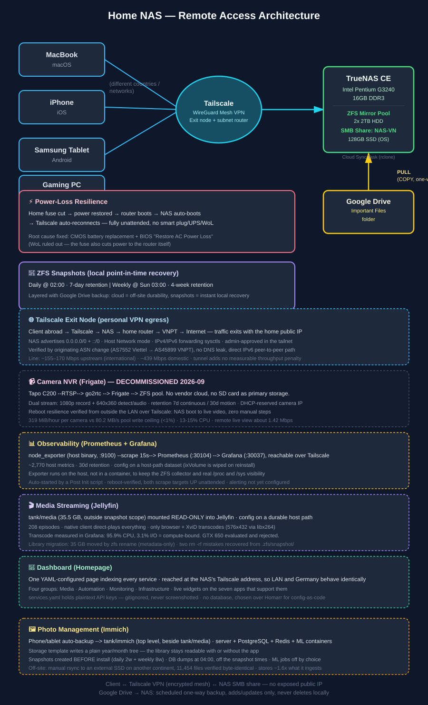
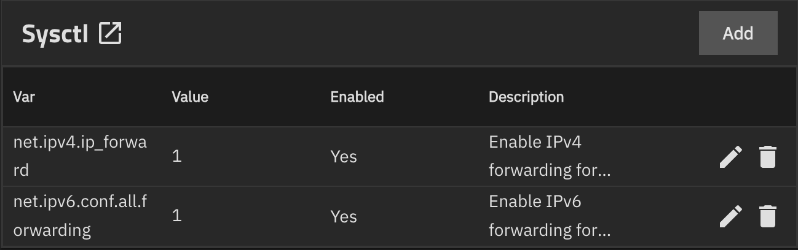
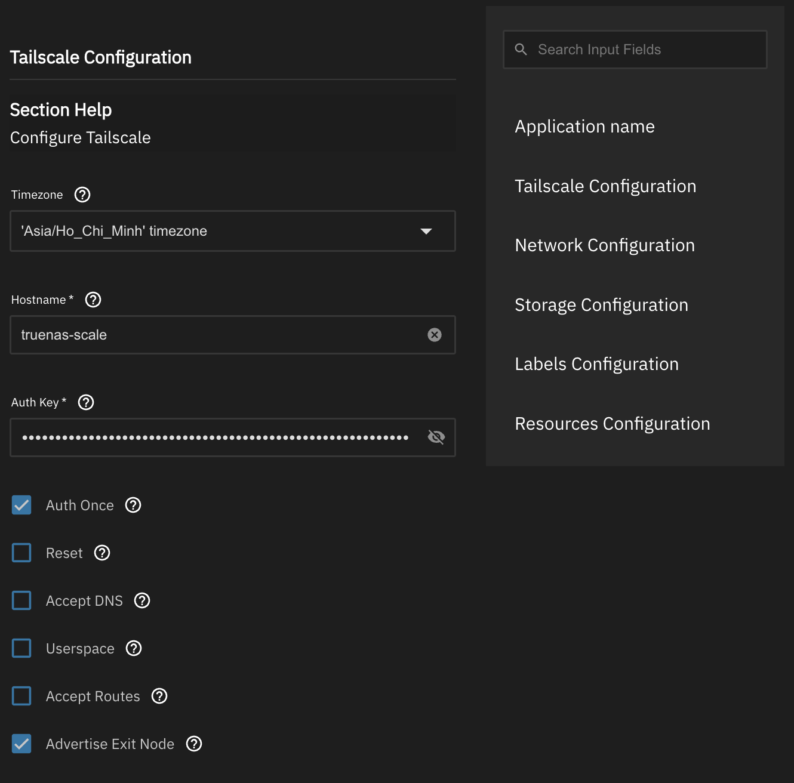
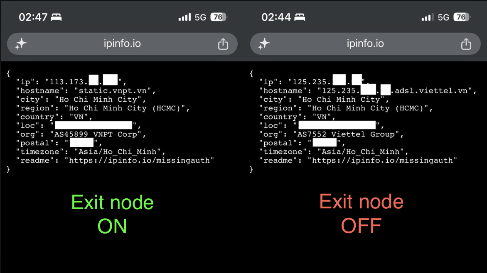
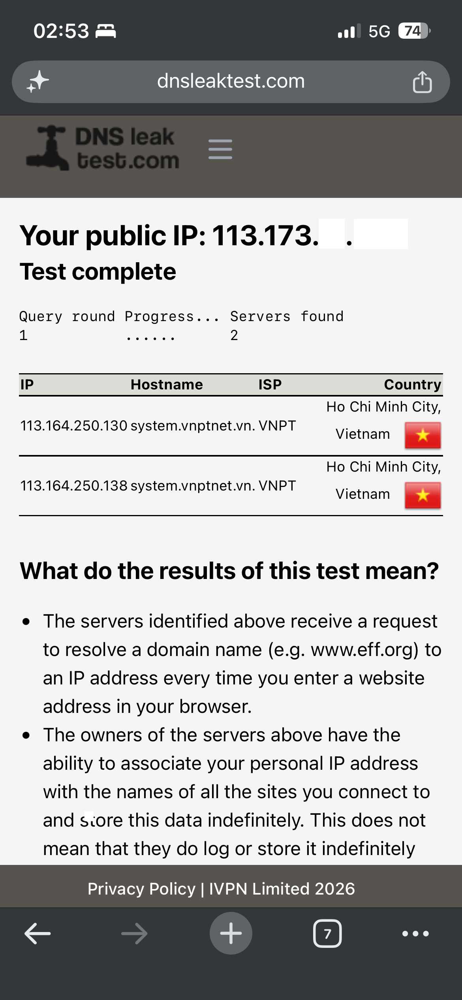

# Home NAS with Secure Remote Access (TrueNAS + Tailscale)

A self-hosted Network Attached Storage system built from repurposed desktop hardware, providing secure, cross-platform remote file access from anywhere in the world.



## Overview

I wanted reliable, secure access to personal files across countries and devices without relying on a third-party cloud storage provider. This project repurposes an old desktop PC into a full NAS using **TrueNAS Community Edition**, with **Tailscale** providing a zero-config VPN mesh so the NAS is reachable from any registered device — no port forwarding, no exposed public IP, no dynamic DNS hacks.

**Goals:**
- Centralized, redundant file storage at home
- Secure remote access from Windows, iOS, and Android
- No reliance on commercial cloud storage
- Persistent, low-maintenance setup that survives reboots
- Automated backup of critical cloud files (Google Drive) to local storage

This is a living project — new capabilities are added and documented incrementally as they're built.

## Architecture

| Layer | Technology |
|---|---|
| Operating System | TrueNAS Community Edition |
| Storage Pool | ZFS mirror (2x HDD) |
| OS Drive | Dedicated SSD |
| Remote Access | Tailscale (WireGuard-based mesh VPN) |
| File Sharing Protocol | SMB (Samba) |
| Clients | Windows, iOS, Android |
| Cloud Backup | TrueNAS Cloud Sync Task (rclone) — Google Drive → NAS |
| Local Point-in-Time Recovery | ZFS periodic snapshots (daily + weekly) |
| Personal VPN / Internet Egress | Tailscale Exit Node (NAS advertises `0.0.0.0/0` + `::/0`) |

See [`docs/architecture.svg`](docs/architecture.svg) for the full diagram.

## Hardware

- CPU: Intel Pentium G3240
- RAM: 16GB DDR3
- Motherboard: ASUS H81M-D (BIOS v2106)
- Storage: 2x 2TB Seagate HDD (mirrored ZFS pool), 128GB Kingston SSD (boot/OS)
- GPU: GTX 650 (available but not currently installed — power draw vs. hardware transcoding tradeoff still under evaluation)
- Router: ISP-issued GPON ONT (no WAN-side Wake-on-LAN support)

**Deployment note:** the NAS is physically hosted at a remote location (family home) and administered entirely over the network — all setup, testing, and troubleshooting shown here was done remotely, with family assisting on-site only for physical steps (e.g., swapping hardware).

## Setup Steps

1. **Install TrueNAS Community Edition** on the SSD boot drive.
2. **Create a ZFS pool** using the two HDDs in a mirror configuration for redundancy.
3. **Create a dataset** and a dedicated TrueNAS user account for file access permissions.
4. **Install Tailscale** via the TrueNAS Apps catalog, initially with Userspace networking enabled.
   *(Later changed — Userspace mode had to be disabled to support exit-node routing. See [Module: Tailscale Exit Node](#module-tailscale-exit-node--personal-vpn).)*
5. **Register the NAS as a persistent Tailscale node** using a *reusable*, *non-ephemeral* auth key — this ensures the machine doesn't drop off the network after a reboot.
6. **Create an SMB share** and expose it to the local network / Tailscale mesh.
7. **Connect each client device:**
   - **Windows:** Mapped the share as a persistent drive (`Z:`) with "Reconnect at sign-in" enabled.
   - **iPhone:** Connected via the Files app using `smb://<tailscale-ip>/<share-name>`.
   - **Android (Galaxy Tab S7):** Connected via My Files → Network Storage → Add manually, using SMBv2/SMBv3 and the Tailscale IP.
8. **Verified persistence** — confirmed TrueNAS apps auto-restart correctly after a full reboot.

## Module: Google Drive → NAS Backup

**Goal:** Keep a local, one-way backup of a critical Google Drive folder so those files stay accessible even if Google Drive is unavailable — without risking accidental deletions propagating from the cloud side.

**Why one-way instead of live 2-way sync:** TrueNAS has no native bidirectional sync option. True 2-way sync would require manually running `rclone bisync` on a cron schedule — more moving parts, and higher risk of conflicts or unexpected deletions. A one-way pull-and-copy was chosen as the safer default; bidirectional sync remains a possible future upgrade if convenience ever outweighs that safety tradeoff.

**Setup steps:**
1. Created a dedicated dataset for the backup target (`GGDrive-backup`), separate from other datasets.
2. Added a Google Drive credential via OAuth under TrueNAS's Cloud Credentials.
3. Created a **Cloud Sync Task** (Data Protection → Cloud Sync Tasks), configured as:
   - **Direction:** Pull (Drive → NAS only)
   - **Transfer Mode:** Copy (adds/updates files; never deletes from the NAS if a file is removed on Drive — this is what makes it safe as a backup, not a mirror)
   - **Remote path:** the target Google Drive folder
   - **Destination:** the `GGDrive-backup` dataset
4. Set a recurring schedule so the task runs automatically rather than requiring manual triggers.
5. Confirmed the export format handling for native Google Docs/Sheets/Slides files (which aren't real files on Drive and need explicit export-format conversion to back up correctly).
6. Ran a **Dry Run** first to verify the file list and paths before committing to a real transfer.
7. Executed the real sync — confirmed successful.
8. Added the `GGDrive-backup` dataset to the existing SMB share, so the backed-up files are reachable from all three client devices over Tailscale, same as the rest of the NAS.

**Status:** ✅ Fully operational — Google Drive files now back up automatically to the NAS on a schedule, viewable from any connected device.

## Module: Power-Loss Resilience & Unattended Recovery

**Goal:** Since the NAS is managed entirely remotely, it needs to survive a full home power interruption (fuse trips, outage) and come back online automatically — without a smart plug, UPS, or WoL trigger, and without needing anyone on-site to intervene.

**Problem discovered:** After a hard power cut (fuse off, not a graceful shutdown), the motherboard's BIOS setting `Restore AC Power Loss → Power On` was reverting to a default that left the machine powered off after power returned. A graceful shutdown never showed this issue, because the PSU's standby power (+5VSB) keeps BIOS settings alive — it's *only* a full power cut that exposes reliance on the onboard CMOS battery.

**Root cause:** A depleted/failing CMOS (CR2032) battery. When standby power is also removed (full power cut), BIOS configuration falls back to the CMOS battery to retain state — a weak battery meant the "power on after power loss" setting silently reset every time.

**Fix & verification:**
1. Replaced the CR2032 CMOS battery on the motherboard (on-site, physical task).
2. Re-entered BIOS and set **Restore AC Power Loss → Power On**.
3. Ran a full real-world test: cut power at the home fuse box → restored it → confirmed the router powered back on independently → confirmed the NAS auto-booted without manual input → confirmed Tailscale auto-reconnected and the NAS was reachable remotely again, fully unattended.

**Why not WoL / a smart plug:** True Wake-on-LAN was ruled out — the fuse cut also kills power to the router itself, so there's no network path to send a WoL packet over in the first place. A smart plug or UPS could add scheduled/remote power-cycling, but wasn't necessary once the actual root cause (CMOS battery) was fixed — the home's own fuse restoring power is now sufficient to bring the whole stack back unattended.

**Status:** ✅ Verified end-to-end — fuse off → fuse on → router boots → NAS auto-boots → Tailscale auto-reconnects, with zero manual steps.

## Module: ZFS Snapshot Strategy

**Goal:** Add fast, local point-in-time recovery on top of the existing off-site Google Drive backup — so accidental deletions or changes can be undone instantly without depending on a cloud restore.

**Design:** Two periodic snapshot tasks on `tank/swimming-pool/sshindow-private`:

| Task | Schedule | Retention | Naming schema |
|---|---|---|---|
| Daily | 02:00 every day | 7 days | `daily-%Y%m%d-%H%M` |
| Weekly | 03:00 every Sunday | 4 weeks | `weekly-%Y%m%d` |

**Rationale:**
- Daily snapshots give fine-grained recovery from accidental deletion or edits within the last week.
- Weekly snapshots extend that safety net to roughly a month of history, at lower storage overhead.
- This creates a **layered backup strategy**: Google Drive Cloud Sync (COPY) provides off-site durability against total local hardware loss, while ZFS snapshots provide instant, local, low-latency recovery for day-to-day mistakes — each covering a failure mode the other doesn't.

**Status:** ✅ Tasks enabled and scheduled. First daily and weekly snapshots run automatically without manual intervention.

## Module: Tailscale Exit Node — Personal VPN

**Goal:** Route a client device's *entire* internet connection out through the home line in Vietnam, so that traffic from abroad reaches the internet via infrastructure I control and is seen by remote servers as originating from the home connection.

```
Client device (abroad)
   │  WireGuard (Tailscale)
   ▼
TrueNAS  ──►  home router  ──►  VNPT  ──►  Internet
```

**What this is, and what it isn't:** this is a *single-egress* personal VPN. It provides a Vietnamese public IP from anywhere, an encrypted tunnel over untrusted networks (hotel / café / mobile), and egress through hardware I own rather than a third party's. It is **not** a commercial VPN replacement — there is exactly one exit location and throughput is bounded by a residential upstream. The trade is control and provenance in exchange for choice of location.

### Prerequisite: kernel IP forwarding

An exit node routes packets that are neither addressed to nor originated by the host, so forwarding must be enabled at the kernel level (**System → Advanced Settings → Sysctl**):

| Variable | Value |
|---|---|
| `net.ipv4.ip_forward` | `1` |
| `net.ipv6.conf.all.forwarding` | `1` |

Saved is not the same as applied — verified directly:

```bash
sysctl net.ipv4.ip_forward net.ipv6.conf.all.forwarding
```

### Configuration change: Userspace networking had to be disabled

This reverses a decision from the original Tailscale install above. In **Userspace** mode, Tailscale runs its own TCP/IP stack inside the container and never touches the host's routing tables — fine for acting as a client, but it means the node can advertise an exit route it is structurally incapable of servicing.

| Setting | Value | Why |
|---|---|---|
| Advertise Exit Node | **on** | advertises `0.0.0.0/0` and `::/0` |
| Userspace | **off** | userspace stack cannot forward other devices' traffic |
| Host Network | **on** | container needs the host's real network namespace |
| Accept Routes | off | this node isn't a subnet-router client |
| Advertise Routes | empty | subnet routing is a separate feature, kept out of scope |
| Timezone | `Asia/Ho_Chi_Minh` | readable log timestamps when debugging from another country |

**Problem discovered:** with every prerequisite satisfied — sysctls verified, `Advertise Exit Node` checked, app redeployed — the Tailscale admin console showed the node as connected but with **no exit-node status at all**. Not "awaiting approval"; nothing.

**Diagnosis:** the TrueNAS UI and the Tailscale admin console are both layers above the process that actually matters. Rather than trusting either, I queried the daemon's own preferences:

```bash
sudo docker exec ix-tailscale-tailscale-1 tailscale debug prefs
```

```json
{
  "AdvertiseRoutes": null,
  "NetfilterMode": 2,
  "NoSNAT": false
}
```

`AdvertiseRoutes: null` while the UI checkbox was enabled — the GUI and the daemon disagreed, so the configuration was never reaching the process. `NetfilterMode: 2` and `NoSNAT: false` were useful *negative* evidence: firewall and NAT were already correct, isolating the fault to route advertisement alone.

**Root cause:** the container runs with `Auth Once` enabled and was already authenticated, with state persisted on an ixVolume. On restart, `containerboot` takes the "already logged in" path and applies options via `tailscale set` instead of `tailscale up`. There is an upstream bug in which `--advertise-exit-node` passed through `TS_EXTRA_ARGS` is silently ignored by the `set` sub-command — so the checkbox had no effect at all.

- [tailscale/tailscale#14496](https://github.com/tailscale/tailscale/issues/14496)
- [truenas/apps#3486](https://github.com/truenas/apps/issues/3486)

**Fix:** apply the flag directly to the daemon.

```bash
sudo docker exec ix-tailscale-tailscale-1 tailscale set --advertise-exit-node
# "AdvertiseRoutes": ["0.0.0.0/0", "::/0"]
```

The node then appeared in the admin console as *awaiting approval*, and was approved at **Machines → truenas-scale → Routing Settings → Exit Node → Allowed**. Advertising alone is deliberately not enough — Tailscale requires an admin to sign off before a node can act as the tailnet's internet gateway.

> **⚠ Operational caveat:** this setting lives in the daemon's persisted state, **not** in the TrueNAS app configuration. It survives restarts and reboots, but rebuilding the app from its TrueNAS settings alone would not restore it, and an app update may re-run the broken code path. Post-upgrade check: re-run `tailscale debug prefs` and confirm both default routes are still present.

### Verification — and why the obvious test would have been worthless

The intended test — "connect from abroad, confirm a Vietnamese IP" — could not be run, because testing was done while physically in Vietnam, on the same network as the NAS. A public-IP check would have returned the same address with the exit node on *or* off: a result that looks like success while proving nothing.

Instead, I compared **autonomous system numbers** across two genuinely different access networks — a phone on mobile data (Viettel) versus the home line (VNPT). An ASN identifies the network that announces an IP block to the global routing table, so a change of ASN means traffic re-entered the internet from a different provider's infrastructure. That is not something a DNS trick or a cached response can fake.

| Exit node | Public IP | Reverse DNS | ASN |
|---|---|---|---|
| **off** | `125.235.x.x` | `…adsl.viettel.vn` | **AS7552 Viettel** |
| **on** | `113.173.x.x` | `static.vnpt.vn` | **AS45899 VNPT** |

*(Public IPs partially masked — the ASN is the evidence here, not the address. Both are dynamic residential/mobile addresses.)*

Corroborated on the NAS itself, which accounted for the traffic it carried — 78 MB transmitted to the client, measured at the router rather than at either endpoint:

```
iphone-13-pro   active; direct [2401:d800:…]:41641, tx 78447936 rx 5026320
```

**DNS:** `dnsleaktest.com` through the exit node returned `113.164.250.130` / `.138` — `system.vnptnet.vn`, VNPT. The correct result here is not "the resolvers are Vietnamese" but **"the resolvers belong to the same network the traffic exits from."** Egress is VNPT and resolvers are VNPT, so queries travel through the tunnel and resolve on the far side; the mobile carrier the device is physically attached to observes only encrypted WireGuard traffic.

**Connection path:** `direct`, not `relay` — peer-to-peer, with no DERP relay in the path. The mobile client connected over **IPv6**: VNPT provides public IPv6, so NAT traversal succeeded without any port forwarding on the router.

### Performance

| Scenario | Down | Up | Idle RTT | Loaded RTT |
|---|---|---|---|---|
| Mobile (5G), no tunnel | 18.35 Mbps | — | 34 ms | 174 ms |
| Mobile (5G), via exit node | 26.96 Mbps | — | 36 ms | 229 ms |
| Home LAN → domestic server | 439.56 Mbps | — | 6 ms | 17 ms |
| Home LAN → international (HK/SG) | 170 Mbps | 170 Mbps | 30 ms | 39 ms |
| **NAS → Cloudflare (upload)** | — | **155.5 Mbps** | — | — |

Measured from the NAS itself, independent of any client or browser:

```bash
dd if=/dev/zero bs=1M count=100 2>/dev/null | \
  curl -s -o /dev/null -w 'upload: %{speed_upload} bytes/sec\n' \
  -T - https://speed.cloudflare.com/__up
# upload: 19432077 bytes/sec  →  155.5 Mbps
```

- **The exit node imposes no measurable throughput penalty.** Traffic through the tunnel (26.96 Mbps) actually exceeded the direct mobile baseline (18.35 Mbps). Routing through Vietnam obviously cannot make a phone faster — the difference is mobile variance between runs — but that is the point: both sit in the same band, so the tunnel is not the constraint.
- **The bottleneck was the mobile access link**, not the NAS. The home line sustains ~155–170 Mbps upstream, roughly six times what was observed through the tunnel.
- **Domestic and international throughput differ by ~2.5×** on the same line (439 Mbps to a Vietnamese server vs 170 Mbps to Hong Kong / Singapore). For exit-node use from Europe the *international* figure is the relevant one; quoting the domestic number would materially overstate expected performance.
- **Bufferbloat is the carrier's, not the NAS's.** The mobile link degraded 34 ms → 174 ms under load with no tunnel involved at all; through the exit node it reached 229 ms. So ~140 ms of queueing is inherent to the mobile network and ~55 ms is attributable to the extra hop. The home line stays clean by comparison (30 → 39 ms international).

### Known limitations

- Single egress location — one exit point, the home line.
- Bounded by residential upstream, and every byte crosses the home line twice (in on the downstream, out on the upstream).
- Latency: traffic from Europe traverses the full round trip to Vietnam and back, which interactive workloads will feel regardless of available bandwidth.
- Availability equals the home connection's availability — a power cut, ISP outage or router failure takes the exit node with it.
- DNS trust is shifted, not removed: queries now terminate at VNPT's resolvers instead of the local access network's. Self-hosted DNS on the NAS would keep resolution on owned infrastructure.
- Exit-node LAN access is deliberately left **disabled** — enabling it would expose the home LAN to exit-node clients, a wider blast radius than this feature needs.

### Runbook

```bash
# Health check
sudo docker exec ix-tailscale-tailscale-1 tailscale status
sudo docker exec ix-tailscale-tailscale-1 tailscale debug prefs | grep -A3 AdvertiseRoutes

# If AdvertiseRoutes is null after an app update or rebuild, reapply:
sudo docker exec ix-tailscale-tailscale-1 tailscale set --advertise-exit-node
```

Expected: the node reports `offers exit node`, and `AdvertiseRoutes` contains both `0.0.0.0/0` and `::/0`.

**Status:** ✅ Operational and verified — exit node advertised, approved, and confirmed carrying client traffic by ASN change, with no DNS leak and no measurable throughput penalty. Cross-country verification from Europe still pending.

<!-- Screenshots to add under docs/img/ — uncomment once committed:






-->

## Key Challenges & Fixes

| Problem | Root Cause | Fix |
|---|---|---|
| Android device intermittently lost VPN connectivity in the background | Android's battery optimization was killing Tailscale's background process | Settings → Apps → Tailscale → Battery → set to **Unrestricted** |
| NAS occasionally disappeared from the Tailscale network after reboot | Auth key was set to ephemeral, causing the node registration to expire | Regenerated the key as **Reusable**, **Ephemeral: off** |
| Needed cloud backup without risking cloud-side deletions wiping local copies | Live 2-way sync isn't natively supported and adds deletion risk | Used one-way **Pull + Copy** Cloud Sync Task instead of bidirectional sync |
| TrueNAS Apps occasionally failed on cold boot with "Unable to determine default interface" | Known Docker/TrueNAS Apps timing/race condition on startup, not a real misconfiguration | Re-select the Apps pool or restart the Docker service after boot |
| NAS didn't power back on after a full home power cut, even with "Restore AC Power Loss" set | Failing CMOS battery — only exposed by full power cuts, since graceful shutdowns rely on PSU standby power instead | Replaced the CR2032 CMOS battery; verified with a real fuse-cut test |
| Tailscale's "Advertise Exit Node" checkbox had no effect — the node never appeared as an exit node at all | Container was already authenticated (`Auth Once`), so `containerboot` applies settings via `tailscale set`, which silently ignores `--advertise-exit-node` from `TS_EXTRA_ARGS` ([upstream bug](https://github.com/tailscale/tailscale/issues/14496)) | Applied the flag directly to the daemon: `tailscale set --advertise-exit-node`; added a post-upgrade check to the runbook |
| Userspace networking (used in the original Tailscale install) cannot support exit-node routing | In Userspace mode Tailscale runs its own TCP/IP stack inside the container and never touches host routing, so it can't forward other devices' traffic | Disabled Userspace, enabled Host Network, and set the IPv4/IPv6 forwarding sysctls |

## Results

- All three client devices (Windows, iOS, Android) reliably connect to the NAS over Tailscale from outside the home network.
- Storage is redundant via ZFS mirroring, protecting against single-disk failure.
- Setup survives reboots and power interruptions without manual intervention.
- The NAS doubles as a personal VPN exit node — client devices can route their full internet connection out through the home line, verified by a change of originating ASN (Viettel → VNPT) with no DNS leak and no measurable throughput penalty.

## Lessons Learned

- Mesh VPNs like Tailscale remove almost all the traditional networking pain (port forwarding, dynamic DNS, firewall rules) from remote NAS access.
- Mobile OS battery management is an under-documented source of "random" VPN drops — worth checking first when debugging intermittent connectivity.
- Auth key configuration (ephemeral vs. reusable) matters more than it seems for long-running headless nodes.
- BIOS "power on after power loss" settings can silently depend on a healthy CMOS battery — this only surfaces during a *full* power cut, since normal shutdowns are masked by the PSU's standby power. Worth testing with a real power cut, not just a reboot, before trusting unattended recovery.
- No single backup mechanism covers every failure mode — off-site cloud copy protects against hardware loss, while local ZFS snapshots protect against accidental deletion/edits with near-zero recovery time. Layering both is more robust than relying on either alone.
- When a GUI reports success and the feature still doesn't work, stop trusting the layer above and query the daemon's own state. `tailscale debug prefs` located a fault that neither the TrueNAS UI nor the Tailscale admin console surfaced at all — and its *other* fields (`NetfilterMode`, `NoSNAT`) ruled out whole categories of cause at the same time.
- A test that cannot fail isn't a test. Checking a public IP while sitting on the same network as the exit node would have "passed" whether or not the feature worked; comparing ASNs across two genuinely different access networks was what made the result mean something.
- Domestic and international throughput on the same line differed by ~2.5×. Benchmark against the path that matches the real use case, not the one that produces the nicer number.
- Configuration applied outside a management UI becomes invisible to that UI's rebuild path. The `tailscale set` workaround works, but it would vanish on a rebuild — which makes it a runbook item, not a one-time fix.

## Future Improvements

- [x] ~~Automated off-site/cloud backup of critical datasets~~ → done via Cloud Sync Task (see above)
- [x] ~~Unattended recovery from a full power outage~~ → done via CMOS battery fix (see above)
- [x] ~~ZFS snapshot strategy for point-in-time recovery~~ → done via daily/weekly periodic snapshots (see above)
- [ ] GTX 650 reinstallation for Jellyfin hardware transcoding — evaluating whether the transcoding benefit is worth the added power draw
- [ ] Jellyfin media server setup
- [ ] True live 2-way sync (`rclone bisync` + cron) — only if convenience outweighs backup-safety tradeoff
- [ ] Monitoring/alerting (e.g., Uptime Kuma or TrueNAS alert integrations)
- [ ] Nextcloud (personal cloud), Vaultwarden (password manager), Pi-hole (network-wide ad blocking)
- [ ] PiKVM for true out-of-band hardware access (board has no IPMI)
- [ ] Self-hosted DNS (Pi-hole / AdGuard Home) as the tailnet resolver, so exit-node queries terminate on owned infrastructure instead of the ISP's
- [ ] Tailscale subnet router to reach home LAN devices remotely (currently out of scope)
- [ ] Tailscale ACLs / auto-approvers so routes re-advertise without manual approval after a rebuild
- [ ] SQM / fq_codel on the router to reduce bufferbloat under load
- [ ] Cross-country verification of the exit node from Europe

---

**Stack:** TrueNAS CE · ZFS · Tailscale (WireGuard mesh + exit node) · SMB/Samba · rclone (Cloud Sync)
