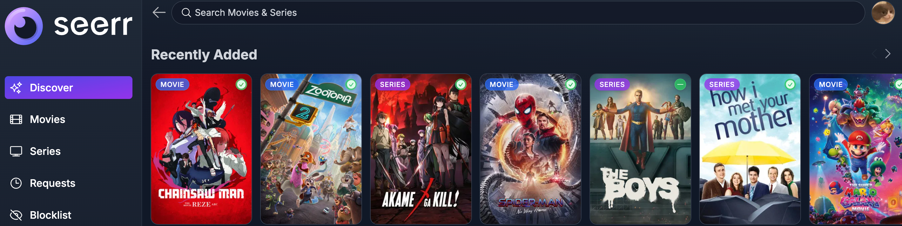
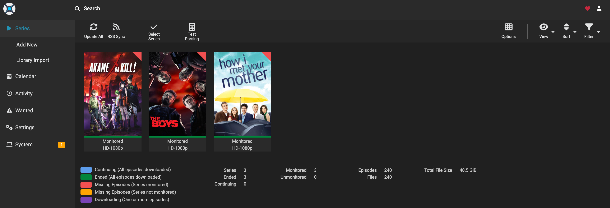
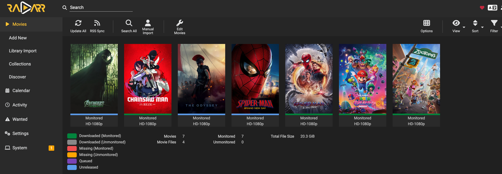
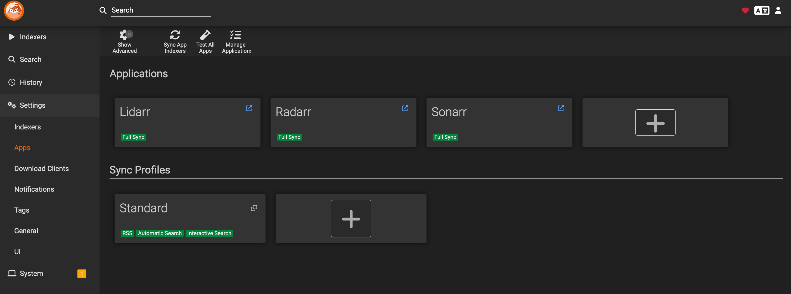
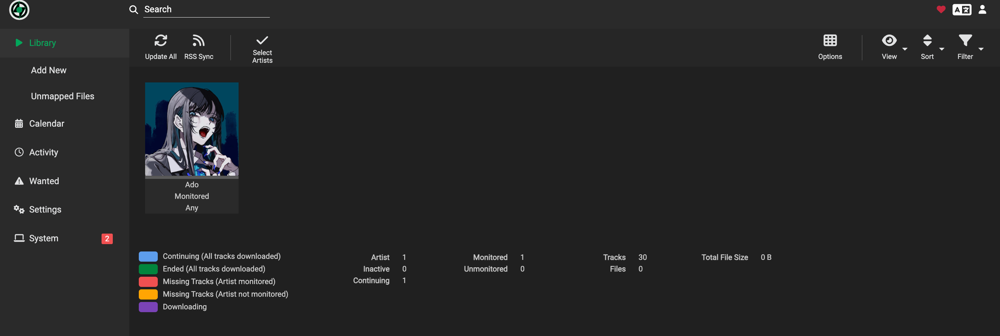
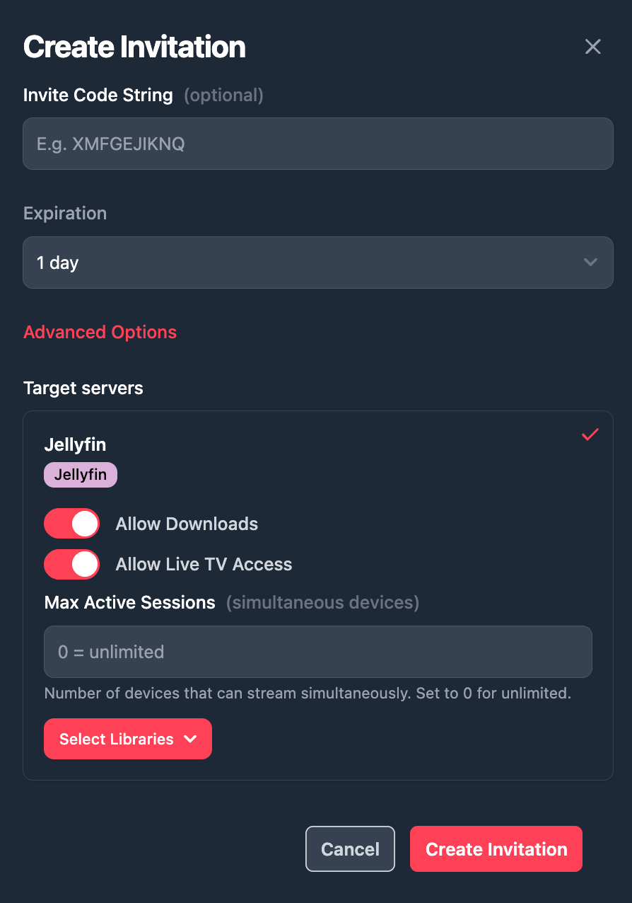
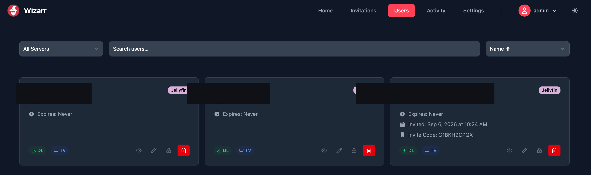
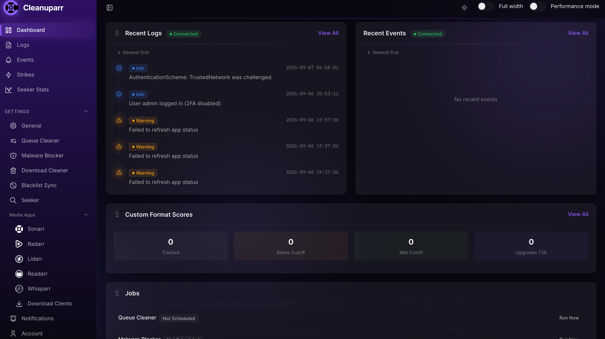
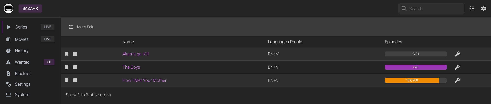

# Media Automation — the arr-stack, Lidarr, and Friend Access (Wizarr + Cleanuparr)

*Part of the [homelab-nas](../README.md) project.*

---

> **Disclaimer:** this module is documented here purely as a personal, educational exercise in self-hosted service orchestration, container networking, and Docker/TrueNAS App deployment — the interesting engineering problems (container-to-container networking, DNS, volume mounts, quality-profile tuning, request-to-playback pipelines) apply identically regardless of what content flows through them. It is not intended for, and this write-up should not be read as endorsing, commercial use, redistribution, or the acquisition of copyrighted material. The specific download-client implementation and any indexer/source configuration are intentionally treated as an opaque, undocumented black box below — this doc describes the pipeline architecture around that layer, not its internals.

**Goal:** turn "find a file → fetch it → put it where Jellyfin can see it" into a pipeline: request in one place, everything else happens on its own. Seerr (requests) → Prowlarr (source aggregation) → Sonarr/Radarr/Lidarr (TV/movies/music matching and management) → a download client (fetching, treated as a black box — see disclaimer above) → Bazarr (subtitles) → [Jellyfin](media-jellyfin.md) (playback, already shipped). Later extended with Wizarr (self-service account invites) and Cleanuparr (stalled-download cleanup) once friend access moved from "one test account" to "up to ~10 people across three countries."

**Note on continuity:** the initial deploy work for this module was done in a separate chat session, then brought back into this project's tracking with screenshots and live container output as the source of truth — worth stating since an earlier compose draft (env-var-driven, with a separate reverse-proxy network) floating around in this project's notes was **not** what actually got built. Everything below reflects what is actually running.



## Architecture

Nine containers, deployed as a single TrueNAS SCALE Custom App (`arr-stack`, via Apps → Discover Apps → Custom App → Install via YAML) on one Docker bridge network, `arrs-network`. A user-defined bridge gives working container-name DNS (e.g. `http://sonarr:8989` resolves between containers) with no separate reverse-proxy network needed. No reverse proxy is used — every service gets a direct TrueNAS-style high port, matching the convention already established by Prometheus/Grafana. Nothing is exposed through the router; everything is LAN/Tailscale-only.

| Service | Role | Port | Container port | Image |
|---|---|---|---|---|
| Prowlarr | Source aggregation | 30089 | 9696 | `lscr.io/linuxserver/prowlarr` |
| Download client | Fetches queued items (details intentionally omitted — see disclaimer) | — | — | — |
| Sonarr | TV/anime management | 30090 | 8989 | `lscr.io/linuxserver/sonarr` |
| Radarr | Movie management | 30091 | 7878 | `lscr.io/linuxserver/radarr` |
| Bazarr | Subtitle management | 30092 | 6767 | `lscr.io/linuxserver/bazarr` |
| Seerr (Jellyseerr) | Request front-end | 30093 | 5055 | `ghcr.io/seerr-team/seerr` |
| Lidarr | Music management | 30094 | 8686 | `lscr.io/linuxserver/lidarr` |
| Wizarr | Jellyfin invite links | 30097 | 5690 | `ghcr.io/wizarrrr/wizarr` |
| Cleanuparr | Stalled-download cleanup | 30096 | 11011 | `ghcr.io/cleanuparr/cleanuparr` |

All original services (through Seerr) run `PUID=568`/`PGID=568`/`UMASK=002` — the same "apps" user convention as the rest of this project — and kept the exact `container_name:` set in the YAML rather than getting an `ix-`-prefixed rename the way Frigate/Jellyfin/Prometheus/Grafana did, since this Custom App doesn't override container naming. Config for every app lives on a host-path dataset, `tank/appdata/arr/<app>:/config`, following the same durable-storage pattern already proven for Prometheus (see [Observability](monitoring-prometheus-grafana.md)) rather than the ixVolume default that doesn't survive a reinstall.

### Storage layout

```
/mnt/tank/media
├── downloads             # managed by the download client — internal structure not detailed here
├── movies
├── tv
│   └── How I Met Your Mother   (pre-existing, Seasons 01–09, predates this stack)
├── music                # added for Lidarr
└── extras               (pre-existing)
```

Every container that touches media (the download client, Sonarr, Radarr, Bazarr, Lidarr) mounts the **whole** `tank/media` dataset as a single `/data`, rather than separate volumes for downloads vs. library. This is the standard arr-stack pattern for a reason: with downloads and the library on the same filesystem, Sonarr/Radarr/Lidarr can hardlink or atomic-move a completed download into place instead of copying it — faster, and no duplicate-space window mid-import.





## Deployment problems and fixes

**Seerr crash-looped on first boot — `EACCES: permission denied, mkdir '/app/config/logs/'`.** The other linuxserver-based images auto-chown their bind-mounted `/config` to `PUID:PGID` via an s6-init step on container start. Seerr's image doesn't do that — its compose sets `user: "568:568"` directly with no init/chown step — so its config directory stayed owned by whatever created it (`root:root`, from Docker auto-creating the bind-mount path on first run). Fix: `sudo chown -R 568:568 /mnt/tank/appdata/arr/seerr` then restart. **General lesson: any non-linuxserver image added to this stack needs its config directory ownership checked manually** — the auto-chown behaviour isn't universal just because it's been reliable so far.

**The classic `localhost` bug, hit on every single app-to-app pairing in this stack.** Prowlarr↔Sonarr, Prowlarr↔Radarr, Prowlarr↔Lidarr, Sonarr/Radarr↔the download client — every one of these defaulted its "Server" field to `http://localhost:<port>`, which from a given container's own perspective resolves to itself, not the other container. Every single case needed the same fix: swap `localhost` for the target's container name on `arrs-network`. See [troubleshooting.md](troubleshooting.md) for why this is worth checking first, reflexively, any time two containers in this stack won't talk to each other.

**Radarr silently grabbed an oversized `Remux-1080p` release under a profile meant to keep things space-reasonable.** The default `HD-1080p` quality profile includes Remux-1080p as an allowed (and top-ranked) tier within "1080p" — an essentially uncompressed rip, which defeats the entire point of choosing 1080p over 4K for storage reasons. Fix: unchecked Remux-1080p in the profile, leaving Bluray/WEB/HDTV-1080p enabled. Sonarr's equivalent profile was checked separately and turned out already clean (no Remux-1080p tier present).

**VNPT's ISP-level DNS interference turned out to be a systemic risk, not a one-off site problem** — hit on Prowlarr (one indexer's SSL handshake failing repeatedly) and again on Seerr (every TMDB-backed discover/search call 500ing) before being recognized as the same underlying pattern. See [troubleshooting.md](troubleshooting.md) for the full diagnosis and the now-standard fix (a per-container `dns: [1.1.1.1, 1.0.0.1]` override).

**Download-client-specific configuration** (WebUI/auth settings, save-path layout, per-category routing, credentials) needed several rounds of fixes during setup, same as everything else in this stack — details intentionally omitted here, consistent with the disclaimer above.

## Source aggregation (Prowlarr)

Prowlarr aggregates multiple external sources and pushes working ones into the consumers that use them (Sonarr/Radarr/Lidarr) via sync. Redundancy was adopted deliberately after enough individual sources turned out to be unreliable for reasons with nothing to do with this NAS — no uptime guarantee, subject to outages and mirror rotation. Rather than chasing each source's uptime individually, the stack runs **several sources spread across categories** (movies, TV, anime) so Prowlarr silently routes around whichever one is down on a given day. Specific source names are intentionally omitted from this write-up, consistent with the disclaimer above; one source remains permanently unavailable due to an access restriction and isn't worth working around given coverage is already met elsewhere.



Sonarr and Radarr are connected to Prowlarr as Apps with Full Sync. One non-bug worth noting: a category-restricted source correctly shows up in only the relevant consumer (e.g. movies-only in Radarr but not Sonarr) — that's Prowlarr's category-aware sync working as intended, not a missing connection.

## Quality decision: 1080p, not 4K

Chosen deliberately for the whole stack rather than defaulting to "biggest available": storage headroom (~1.7 TiB usable pool, with 208 TV episodes alone running ~150GB+ at 1080p), no genuine 4K master exists for most of the library's actual content, and no hardware in this NAS can decode HEVC even if it existed (the spare GTX 650 is Kepler-generation NVENC/NVDEC, H.264-only; the Pentium G3240's Haswell Quick Sync predates HEVC support entirely — see [Media Streaming](media-jellyfin.md) for the full GPU evaluation). Radarr/Sonarr/Lidarr are all set to `HD-1080p` profiles (with the Remux tier removed, above) rather than a mixed 720p/1080p profile, so anything already below 1080p shows as upgrade-eligible instead of being silently accepted as good enough.

## Real-world throughput finding (important, not obvious from a generic speedtest)

Discovered via the first real movie streamed through this pipeline, not during initial setup — worth calling out here since it changes how this whole stack should actually be used day to day. Full detail, including two `iperf3` measurements three weeks apart, lives in [Media Streaming](media-jellyfin.md#real-world-remote-playback-throughput--variable-not-fixed-2026-08-28-updated-2026-09-08). Short version: a generic speedtest from the NAS showed a healthy 161 Mbps, but the real Vietnam↔Germany path has measured anywhere from ~3.78 Mbps to ~22.6 Mbps depending on conditions on a given day — a variable international-routing characteristic, not a fixed ceiling and not a config problem. TV-episode bitrates (~2 Mbps) stream live from Germany without issue regardless; Blu-ray-tier movie bitrates are a gamble that depends on the day, so a manually bitrate-capped stream or a full local download stays the safe default. **Practical consequence for this stack:** it's used for occasional acquisitions of rare films, watched either quality-capped live or downloaded-then-played-locally — not as a daily-driver live-streaming service.

## Extension: Lidarr (music) — paused, curated-artist scope

Lidarr was added as a 7th service on the same pattern as everything above (`lidarr` container, `lscr.io/linuxserver/lidarr`, port 30094, `/mnt/tank/media:/data`, `/mnt/tank/appdata/arr/lidarr:/config`). The build itself was routine — the interesting part is a real scope change mid-build.

**Original goal:** a broad Spotify-replacement, auto-managing a large music library.

**Revised goal, same day:** Lidarr manages music at **artist/album granularity, not individual-track or playlist granularity** — it fetches whole albums/EPs/singles, it cannot cherry-pick a single song out of an album the way Spotify can. Once that was clear, the goal narrowed to **curated lossless archiving of a small set of specific favorite artists** (e.g. Yoasobi, Ado) whose music isn't available in lossless quality on the local Spotify catalogue — not a full automated sweep.

That reframing changed the quality-profile decision too: `Lossless` (a strict FLAC/ALAC allow-list with no fallback) is a real risk for a broad auto-managed library, since it can leave an album permanently ungrabbed if no lossless release exists anywhere. For a small, manually-curated set of artists, that risk stops applying — any gap is immediately visible and decidable case by case — so the root folder's Quality Profile was set to `Lossless` deliberately.

**Source coverage** — an existing source already in the stack for anime turned out to also cover this scope's needs well, with no new source configuration required (specific source names intentionally omitted, consistent with the disclaimer above).



**Status: paused before the end-to-end test was confirmed complete**, for a genuinely practical reason: the desktop speakers in use (a budget Logitech Z523 2.1 set) aren't capable of resolving a lossless-vs-high-bitrate-lossy difference in practice, which undercuts the immediate payoff of the `Lossless` profile — the underlying reasoning (no lossless option locally) still holds, there's just no audible benefit on the current playback chain. Resume points, in order: (1) decide `Standard` vs. `Lossless` given real playback hardware — switching later is non-destructive, Lidarr just treats existing files as below-cutoff and searches for an upgrade; (2) confirm/retry the first Yoasobi download (never confirmed complete after a source went down mid-test); (3) add a Jellyfin Music library; (4) revisit Finamp for offline mobile listening.

**Note for anyone extending this further:** Seerr/Jellyseerr has **no Lidarr integration at all** (Radarr/Sonarr only) — there's no "request an album" front-end, artists have to be searched and added directly in Lidarr's own UI. The closest friend-facing alternative in this ecosystem is the Discord bot **Requestrr**, not pursued here.

## Extension: friend access — Wizarr + Cleanuparr

Added once the plan changed from "one test account" to eventually sharing Jellyfin with up to ~10 close friends across Vietnam, Germany, and the US. Two tools, evaluated and added together:

- **Wizarr** — turns account creation into a self-service invite link (with expiry/library scoping), instead of manually creating each friend's Jellyfin account and relaying a password over chat. It only automates the Jellyfin account step — it does not auto-provision a linked Seerr account (its own docs describe it as just "guiding" users toward Overseerr/Jellyseerr) — so importing each friend into Seerr for requests stays a manual step either way.
- **Cleanuparr** — auto-cleans stalled/failed/malicious downloads out of the download client and tells Sonarr/Radarr/Lidarr to re-search, useful once more people generate download traffic than one person's own usage patterns.

**Tdarr was evaluated and explicitly declined** at this stage — it would only reformat existing files to a unified codec, and with no HEVC-capable hardware anywhere in this NAS (see the Quality decision above), it wouldn't currently change what's playable or fix any real problem; revisit only if hardware changes.

### Deploy incident: the whole Custom App got stuck "Deploying"

Adding both services and redeploying left the arr-stack Custom App showing "Deploying" indefinitely. `docker ps` confirmed all 7 pre-existing containers were untouched and healthy — the redeploy of a Custom App to add new services does not disturb unrelated containers. `docker ps -a --filter name=wizarr` showed Cleanuparr had actually started fine, but **Wizarr was stuck in `Created`, never started**.

The initial hypothesis — a stuck pull from `ghcr.io`, a registry nothing else in this stack had used before (everything else came from the already-cached `lscr.io`) — turned out to be **wrong**: Cleanuparr also pulls from `ghcr.io` and started immediately, ruling that out. The real cause: **a port collision.** Wizarr's assigned port, `30095`, was already bound by an unrelated `homepage` dashboard container running on this NAS. `docker start wizarr` surfaced the exact error (`Bind for 0.0.0.0:30095 failed: port is already allocated`), confirming it. Fix: reassigned Wizarr to `30097` in the YAML and redeployed — it started cleanly. **Lesson: the Applications page's status badge is not reliable ground truth** — `docker ps -a`, `docker logs`, and `docker top` are.

### Wizarr → Jellyfin connection: two non-obvious findings

**Needed the NAS's own Tailscale IP, not its LAN IP, to reach Jellyfin — the opposite of Seerr's working setup.** Seerr reaches Jellyfin at the LAN IP (`192.168.1.4:30014`), since Jellyfin runs on its own separate Docker network. Trying the same pattern for Wizarr (`192.168.1.4:30013`) silently found zero libraries when scanning; switching to the NAS's Tailscale IP (`100.x.x.x:30013`) immediately found all three libraries. Root cause not fully pinned down (Wizarr's container networking apparently resolves the two paths differently than Seerr's), but the working answer is confirmed empirically — worth checking first if this stack ever adds another Jellyfin-integrated tool that behaves like Seerr rather than like Wizarr.

**A trailing slash in the server URL broke the final "Test & Add" step with an HTTP 404 — even though the library scan on the same URL had already succeeded.** Wizarr's connection-verification call likely does simple string concatenation onto the base URL, so a trailing `/` produces a double-slash request path. Removing the trailing slash fixed it immediately.

**End-to-end test: confirmed working.** Created a test invitation (1-day expiry, Movies + TV libraries), opened the link in a private browser window, created a Jellyfin account through it, logged in, and played a film successfully.





### Cleanuparr: the missing volume mount

Cleanuparr's container originally only had `/config` mounted — no access to the actual downloaded files at all, unlike every other app in this stack, which meant its "Download Directory Source/Target" path-remapping fields could never actually work no matter what was typed into them. Fix: added the same `tank/media:/data` mount every other app already uses. With that in place, Cleanuparr sees files at the exact same path the download client reports, so both directory-remapping fields are correctly left blank — no translation needed. Connected to the download client and all three *arr apps via the standard container-name pattern (`http://sonarr:8989`, `http://radarr:7878`, `http://lidarr:8686`, plus the download client).



## Still open

- One source remains permanently unavailable due to an access restriction; a known workaround exists but isn't pursued (not urgent, coverage already met by the other sources).
- Lidarr paused mid-build — see the four resume points above.
- HIMYM's Bazarr subtitle count is stuck at 182/208 (S06E21–24 English, ~20 episodes of S09 Vietnamese) — a manual search was triggered but the count never moved; accepted as-is rather than pursued further.

  
- HIMYM's old-codec (XviD) episode audit/selective-redownload was considered and explicitly deprioritized.
- No reverse proxy — deferred by choice.
- A download-client-specific behavior setting was found reverted to a state contradicting the originally-documented decision during a later health check (either changed in an untracked session, or the original change never actually applied). Fixed for the one affected item as a same-day workaround; has not visibly broken anything so far, but is only one data point against the original hardlink-safety concern — worth re-checking if Radarr/Sonarr imports ever start behaving oddly.

**Status:** ✅ Operational end-to-end — Seerr → Prowlarr → Sonarr/Radarr → download client → Bazarr → Jellyfin confirmed working with a real request, download, and remote playback; Wizarr and Cleanuparr both deployed, connected, and verified working for friend access. Lidarr deployed and configured but paused before its end-to-end test was confirmed.
