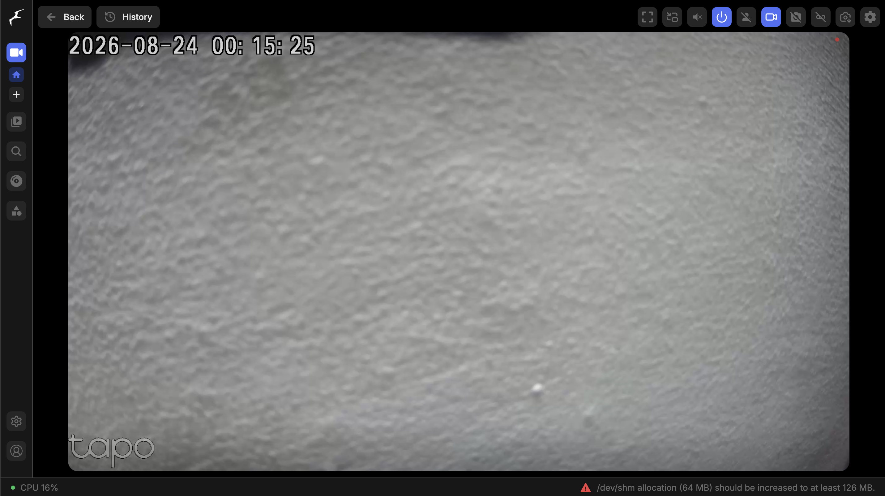
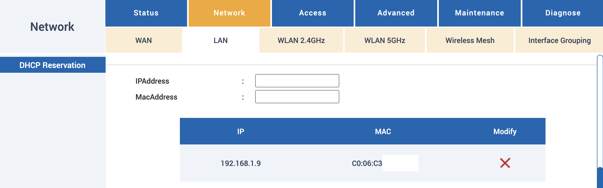
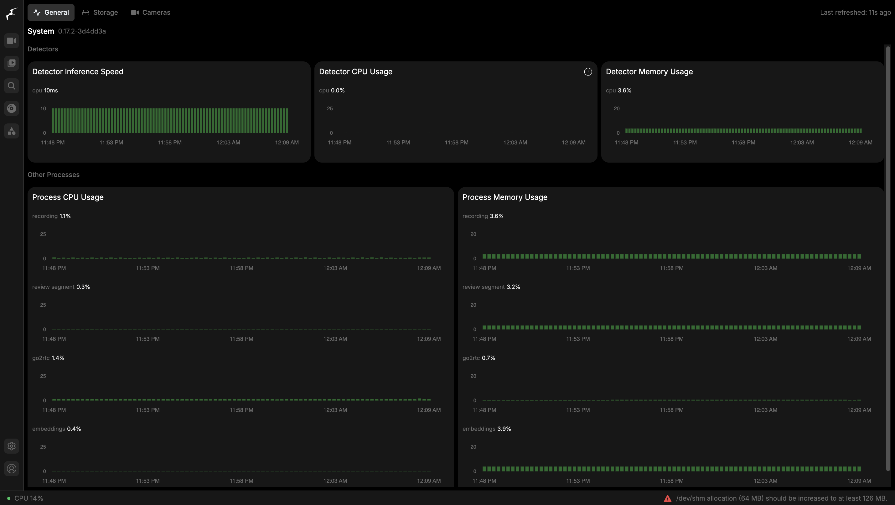
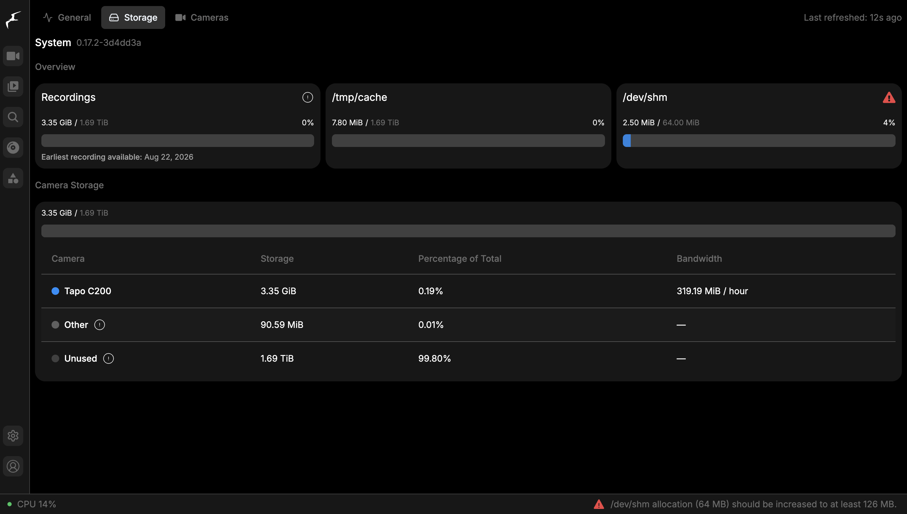

# Camera NVR (Frigate)

*Part of the [homelab-nas](../README.md) project.*

---

**Goal:** Record a TP-Link Tapo C200's RTSP stream onto the NAS's ZFS pool, retiring the camera's 32 GB SD card as primary storage — and keep the footage off the vendor's cloud. A secondary goal was to collect real performance numbers rather than trusting the setup wizard's estimates.

**Why Frigate rather than plain ffmpeg or go2rtc alone:** all three can pull RTSP and write files. Frigate was chosen because person/object detection is a later goal, and with Frigate that becomes a config change rather than a migration to a different recording stack. Paying a small complexity cost now to avoid re-platforming later.

**Cloud isolation — deliberately "soft":** no Tapo Care subscription, no cloud recording, RTSP straight to the NAS. The camera is *not* firewalled or VLAN-isolated from the internet at this stage. That's an honest limitation rather than an oversight: the recording path is fully local, but the camera can still reach TP-Link. Hard isolation (VLAN + egress block) is a future improvement.

## Deployment

| Item | Value |
|---|---|
| App | Frigate via TrueNAS Apps catalog |
| Image | `ghcr.io/blakeblackshear/frigate:0.17.2` |
| Container | `ix-frigate-frigate-1` |
| Config | `/mnt/.ix-apps/app_mounts/frigate/config/config.yaml` (`.yaml`, not `.yml`) |
| Web UI | host port `30193`, reachable remotely over Tailscale |

**Camera configuration:** camera key `tapo_c200`, using both of the camera's streams for different jobs:

| Stream | Resolution | Roles |
|---|---|---|
| `tapo_c200_1` | 1920×1080 | `record` |
| `tapo_c200_2` | 640×360 | `detect`, `audio` |

Both are restreamed through **go2rtc** with *Reduce connections to camera* enabled — a small CPU cost accepted in exchange for fewer redundant RTSP connections to a camera that doesn't handle them gracefully.


*Live tile served by Frigate. The camera is aimed at a blank wall for this screenshot — the point is the pipeline, not the room.*

**Retention:** continuous 7 days, motion 30 days. At the measured ~11.8 GB/day that's roughly 83 GB — comfortable against 1.69 TiB free.

## Problems hit during setup

Four of these cost real time and none of them are documented clearly upstream, so they're recorded here in full.

**1. App install appears to hang at 60%.** Transient and self-resolving on TrueNAS SCALE — no intervention needed. Worth knowing before you start killing and reinstalling the app.

**2. The first-login admin password never appears in the logs.** A known TrueNAS SCALE + Frigate interaction. Fix:

```yaml
# config.yaml — top-level key
auth:
  reset_admin_password: true
```

Restart the container and watch the logs live to catch the generated password as it scrolls past:

```bash
sudo docker logs -f ix-frigate-frigate-1
```

> **Set `reset_admin_password: false` again immediately afterwards.** Left enabled, it regenerates a new unknown password on every restart — turning a one-time annoyance into a permanent one.

**3. ONVIF auto-probe fails against the Tapo C200** — the camera wizard's *Probe camera* option returns "No RTSP URLs found." This is a known Tapo/Frigate ONVIF incompatibility, not a misconfiguration, and no amount of retrying fixes it. Workaround: **Manual selection → brand "Other" → paste the literal RTSP URL.** Also worth recording for anyone revisiting ONVIF: the Tapo's actual ONVIF port is **2020**, not the wizard's default placeholder of 80.

**4. RTSP authentication requires a *local* camera account.** The Tapo cloud login is not the RTSP credential. A separate "Camera Account" must be created in the Tapo mobile app under **Advanced Settings**; that username/password is what the RTSP URL refers to.

**Config gotcha:** in Frigate v0.17, `record.continuous` and `record.motion` accept only a `days` field — there is **no `mode` field** at that level. `mode` exists only under `alerts.retain` / `detections.retain`, which belong to the object-detection review system. Adding it under continuous/motion fails config validation.

## Reliability hardening

**Static addressing.** The camera's IP is pinned by DHCP reservation on the router (VNPT iGate GW040-NS → **Network → LAN → DHCP Reservation**), binding the camera's MAC to `192.168.1.9`. Without this, a lease change after a power cut would silently break the RTSP URL while everything else looked healthy. *(The router's UI requires colon-separated MAC notation — hyphens are rejected.)*



**Full reboot-resilience test — PASSED.** The whole NAS was rebooted, then verified **remotely over Tailscale** (MacBook tethered to phone cellular data, using the Tailscale address rather than the LAN one) that Frigate's web UI loaded *and* the camera tile showed live video.

That single check exercises the entire chain unattended: NAS boots → Docker starts → Frigate container comes up → camera rejoins Wi-Fi on its reserved IP → Frigate re-establishes RTSP → Tailscale reconnects. Zero manual intervention at any step. Testing it from a non-LAN network mattered — checking from inside the house would have proven considerably less.

## Performance

| Measurement | Result |
|---|---|
| Baseline ZFS sequential write | **80.2 MB/s** (disk-bound) |
| Frigate recording bandwidth, 1 camera | **319.19 MiB/hour** (~90.7 KB/s) |
| Frigate CPU load, sustained recording | **13–15%** total on the Pentium G3240 |
| Detector inference (CPU-based, no Coral) | 10 ms |
| Remote live-view over Tailscale (Vietnam-cellular baseline) | ~176.9 KB/s down / ~3.1 KB/s up (**≈1.42 Mbps**) |
| Remote live-view over Tailscale (real cross-country, from Germany) | ~92 KB/s down / ~4.4 KB/s up (**≈0.74 Mbps**) |


*Detector inference at 10 ms, total CPU 14% while recording.*


*319.19 MiB/hour for one camera against 1.69 TiB free — and the `/dev/shm` warning, visible bottom right.*

**Benchmarking methodology matters more than the numbers — a worked example.** The obvious disk benchmark is wrong on this pool:

```bash
# WRONG on a pool with lz4 compression — reports 3+ GB/s
dd if=/dev/zero of=/mnt/tank/test bs=1M count=20000

# Correct: incompressible data, forced sync, larger than the 16 GB of RAM
dd if=/dev/urandom of=/mnt/tank/test bs=1M count=20000 conv=fdatasync
```

`lz4` is inherited pool-wide, so an all-zero input compresses to almost nothing and the "throughput" figure measures the compressor, not the disks. It reported 3+ GB/s regardless of file size — implausible for two mechanical drives, which is what gave it away. Switching to `/dev/urandom` with `conv=fdatasync`, at a size exceeding RAM so the ARC can't absorb it, produced the real **80.2 MB/s**.

**Headroom:** one camera consumes well under 1% of the disk's write throughput. Storage is nowhere near a bottleneck; this box could record many more cameras before disk I/O mattered. Notably the measured 319.19 MiB/hour also came in well below the camera-add wizard's pre-tuning estimate of ~480 MiB/hour, so the dual-stream + go2rtc configuration paid off.

**A measurement thrown out.** The first remote live-view figure was invalid: the "before" and "after" byte counters straddled an unnoticed switch from cellular to home Wi-Fi mid-test, visible afterwards as an implausible 3× jump in instantaneous receive rate between the two readings. Redone with the connection state confirmed throughout and a genuine 134-second sample (cross-checked against the camera's on-screen clock overlay). Worth stating plainly: a measurement whose conditions changed underneath it is not a conservative measurement, it's a wrong one.

That ~1.42 Mbps is application-level data for one modest-bitrate stream — it is **not** comparable to the exit node's link-saturation speedtest figures (18–27 Mbps). Different question, different measurement.

**Real cross-country figure, from Germany.** Once back in Germany, the same test was redone on a real Vietnam↔Germany connection (exit node off — this test only needs the base Tailscale mesh, not the exit-node feature) — Rcvd Bytes 11.1 MB → 19.4 MB over an approximately 90-second sample (timed against the camera's on-screen overlay for the end point; the start point was timed by wall clock, so call it 90s ± 15s), giving **~92 KB/s down / ~4.4 KB/s up ≈ 0.74 Mbps**. That's noticeably *lower* than the Vietnam-cellular baseline above, not higher — worth stating honestly rather than reading into it: H.264 bitrate is scene-dependent (a mostly-static room compresses far more than one with motion), so part of the gap could be less motion in this particular sample rather than the network path itself. What the number does confirm cleanly is that real cross-country distance doesn't blow the bandwidth budget — even the higher of the two readings is trivial next to the 91 Mbps+ home connection measured for the exit node.

**Open watch item:** Frigate flags `/dev/shm` (64 MB) as below its recommended 126 MB minimum. Actual usage sits at a few MiB of the 64 MB allocated, so there's no practical pressure, and the TrueNAS SCALE 25.10-specific fix could not be confirmed — a community thread on the same version was redirected to a separate unresolved support thread. Parked deliberately rather than chased.

## Known limitations

- **Cloud isolation is soft** — no cloud recording or subscription, but the camera is not blocked from reaching TP-Link.
- **No person/object detection yet.** Detection runs on CPU; reliable person/stranger alerting needs a Coral USB TPU (~$60–70), not yet purchased. The Frigate choice means adding it is a config change.
- **Recording depends on the camera's Wi-Fi.** A wired camera would remove a failure mode, but placement won.
- **Single copy.** Footage lives on the ZFS mirror — redundant against a disk failure, but it is not backed up off-site the way the Google Drive dataset is.
- **Cross-country access is now verified.** ~~Remote viewing was tested from cellular *within Vietnam*; a real Germany↔Vietnam figure is still pending.~~ Confirmed 2026-08-28 from a real Germany connection: ~0.74 Mbps for the live view, reachable and usable at real distance.

**Status:** ✅ Operational — recording continuously to the ZFS pool, surviving full reboots unattended, benchmarked end to end (including a real Germany↔Vietnam cross-country figure), and reachable remotely over Tailscale. Vendor cloud carries none of the footage.
