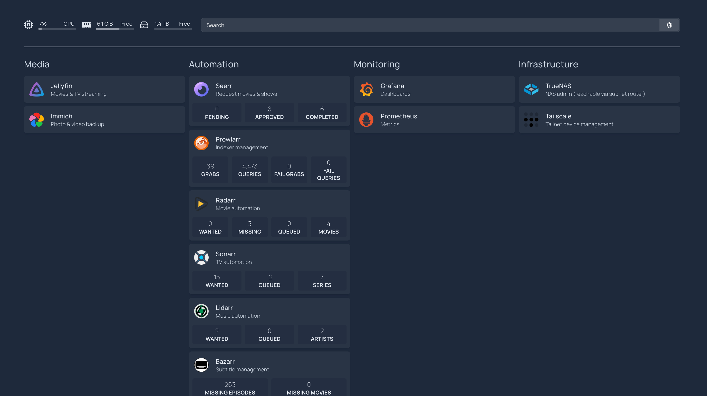
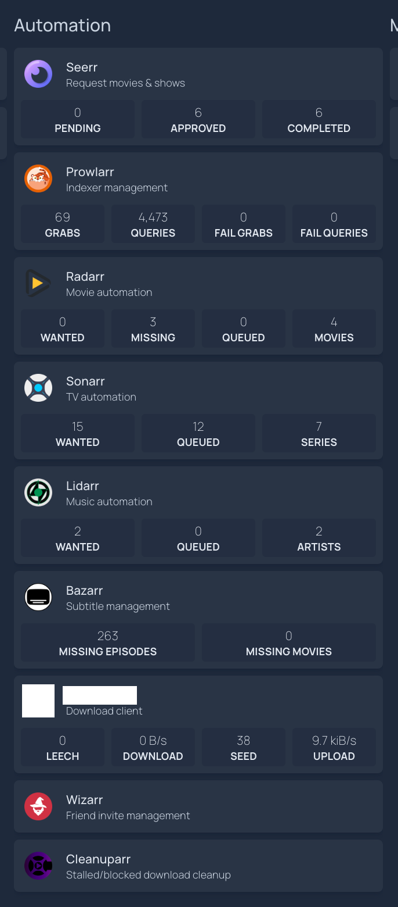

# Dashboard — Homepage

*Part of the [homelab-nas](../README.md) project.*

---

**Goal:** one page that reaches every service on the NAS, without remembering which TrueNAS-assigned port belongs to which app — and behaving identically from the Vietnam LAN or from Germany over Tailscale.

By this point the box runs eight-plus web UIs, each on an arbitrary high port the appliance picked. Bookmarks drift, ports move on redeploy, and the mental index doesn't survive three weeks away. That's the problem this module solves — it adds no capability, it removes friction.


*Four groups, one page. The header strip carries live host CPU, free memory and free pool space.*

## Tool choice: Homepage, not Homarr

Both are self-hosted dashboards. Worth clearing up a naming coincidence first: **Homarr is unrelated to the Servarr/*arr family** — Sonarr, Radarr, Prowlarr and the rest — despite the matching suffix. It is not a sibling project, and the similarity implies an integration story that doesn't exist.

| | Homepage | Homarr |
|---|---|---|
| Config | plain YAML files | database-backed |
| Editing | text editor | drag-and-drop GUI |
| Version control | diffable, committable | not meaningfully diffable |
| Footprint | no database | heavier |

**Homepage won on config-as-code.** Its configuration is YAML on disk, which matches how the rest of this project is managed and can be reasoned about in a diff. Homarr's GUI editor is genuinely nicer to use, but a database-backed config can't be reviewed, and on a two-core G3240 already running Frigate, the arr-stack, Jellyfin and Prometheus, the lighter footprint mattered too.

That trade only goes this way because the dashboard is edited rarely and read constantly.

## Deployment

**Deliberately a standalone Custom App, not merged into the arr-stack's compose file.** Homepage has no service-to-service dependency on those containers — it reaches everything over HTTP like any browser would. The arr-stack's containers share `arrs-network` because they genuinely need to resolve each other; Homepage doesn't. Keeping it separate means redeploying one never restarts the other.

| Item | Value |
|---|---|
| Image | `ghcr.io/gethomepage/homepage:latest` |
| Port | `30095:3000` (next free after Seerr) |
| Dataset | `tank/appdata/homepage` |
| Volume | `/mnt/tank/appdata/homepage:/app/config` |

**The dataset ownership gotcha, for the third time.** A newly created dataset is `root:root`, and the container runs as `568:568`, so it needs `chown -R 568:568` before the app will start — the same fix Seerr needed, and the same class of problem as the Prometheus config dataset. At this point it's predictable enough to do preemptively rather than diagnose again.

**`HOMEPAGE_ALLOWED_HOSTS` is required, not optional.** Homepage's Next.js layer validates the `Host` header and rejects any address not explicitly listed. Every access path has to be enumerated:

```
HOMEPAGE_ALLOWED_HOSTS=<tailscale-ip>:30095,192.168.1.4:30095,localhost:30095
```

Two things make this sharper than it looks: a missing entry fails as a refused request rather than an obvious error, and **changing the value requires recreating the container** — a restart silently keeps the old list.

## Incident: registry pull timeouts

The first deploy attempts failed pulling from `ghcr.io` with `context deadline exceeded`.

The useful step was checking `app_lifecycle.log` rather than retrying, which showed **the same failure signature twice before on this machine** — the arr-stack pulling from `lscr.io` and Immich pulling from Docker Hub, both on 31 August, both the same timeout pattern. Three registries, three different apps, one shared symptom.

**Root cause: overseas registry pulls competing with a concurrent rsync backup job**, both crossing the same thin, lossy Vietnam↔international route already characterised in the [Jellyfin throughput work](media-jellyfin.md#real-world-remote-playback-throughput--variable-not-fixed-2026-08-28-updated-2026-09-08). Nothing to do with Homepage, or with `ghcr.io`.

The fix was to wait for the backup to finish and retry. The lesson generalises: **on this connection, don't start container pulls while a large backup is running.** The route has roughly one job's worth of usable international bandwidth at a time.

## `services.yaml` structure

Four groups:

| Group | Contents |
|---|---|
| **Media** | Jellyfin, Immich |
| **Automation** | Seerr, Prowlarr, Radarr, Sonarr, Lidarr, Bazarr, the download client, Wizarr, Cleanuparr |
| **Monitoring** | Grafana, Prometheus |
| **Infrastructure** | TrueNAS (LAN IP, reachable remotely via the subnet router), Tailscale admin console (external link) |

**Every entry points at the NAS's Tailscale address rather than a container name.** That's the same cross-bridge-network problem documented for [Prometheus and Grafana](monitoring-prometheus-grafana.md) — containers on separate Docker bridges can't resolve each other by name. Using the Tailscale address instead of the LAN IP has a second benefit: the identical config works from the Vietnam LAN and from Germany, which is the whole point of the module.

The TrueNAS entry is the exception, using the LAN IP — reachable remotely because of the [subnet router](tailscale-exit-node.md#extension-subnet-router).

### Widgets

Native Homepage widgets are wired up and returning live data for **Sonarr, Radarr, Prowlarr, Lidarr, Bazarr, Seerr and the download client**. The download client's widget authenticates with a username and password rather than an API key.

```yaml
- Sonarr:
    href: http://<tailscale-ip>:PORT
    widget:
      type: sonarr
      url: http://<tailscale-ip>:PORT
      key: {{HOMEPAGE_VAR_SONARR_KEY}}
```

**A key-format note worth recording:** Overseerr/Seerr-family apps generate API keys as long base64 strings, not the 32-character hex the *arr* family uses. That difference looks like a copy-paste error the first time and isn't.


*Live counts pulled straight from each app's API — request states, indexer grabs and query totals, wanted/queued/missing counts, subtitle gaps, transfer rates. The download client's tile is redacted here for the same reason it goes unnamed in the [arr-stack module](arr-stack.md). Wizarr and Cleanuparr sit at the bottom as plain link tiles, with no widget to show.*

**No native widget exists for Wizarr or Cleanuparr.** Confirmed against Homepage's own supported-widget list and upstream discussions: Wizarr integration is an open, unimplemented feature request, and Cleanuparr isn't in the list at all — neither was confirmed to expose a documented public API of its own. Both stay as plain link tiles, which is functionally fine. Homepage's generic `customapi` widget is a possible future path if an endpoint turns up, but it wasn't worth chasing for two tiles.

**Readarr** was briefly added and then reverted — not for any Homepage reason, but because Readarr itself was pulled from the arr-stack over a compatibility issue.

## Secrets — this module's real risk

`services.yaml` holds **five plaintext API keys and the download client's WebUI password**. Handling rules, applied before this doc was written:

- It is **never committed** to this repository
- It is **never screenshotted** for these docs
- `.gitignore` was extended to cover it — the previous rules matched `*tskey*`, `*authkey*` and `*.token`, none of which would have caught `services.yaml`

The snippet above uses Homepage's `{{HOMEPAGE_VAR_*}}` environment-variable substitution rather than literal keys, which is the right pattern if the config is ever version-controlled privately.

This is the one module where the configuration file is more sensitive than anything it configures — a single file granting API access to seven services at once.

## Known limitations

- **No widgets for Wizarr or Cleanuparr** — link tiles only, pending upstream support.
- **Secrets sit in plaintext on disk.** Homepage supports env-var substitution, which moves them out of the YAML, but they remain readable to anything that can read the container's environment.
- **`HOMEPAGE_ALLOWED_HOSTS` is a manual list.** A new access path (another tailnet device on a different address, a domain name later) means editing it *and* recreating the container.
- **The dashboard is not a health check.** A tile renders whether or not the service behind it is well; widgets show data but absence of data reads as an empty tile, not an alert. Uptime Kuma remains the right tool for reachability alerting.

**Status:** ✅ Operational — every service reachable from one page, identically from the Vietnam LAN and from Germany, with live widgets on the seven apps that support them.
