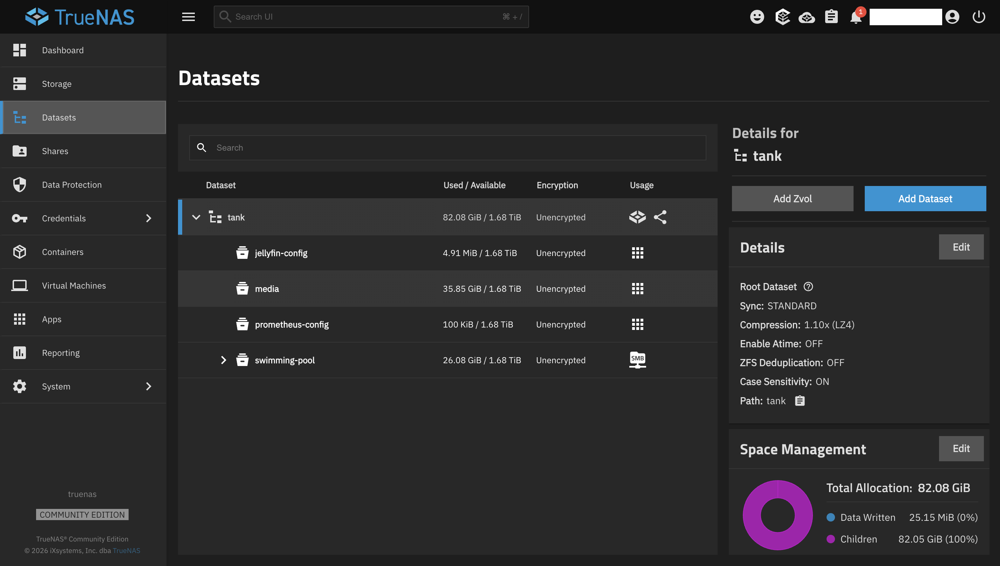
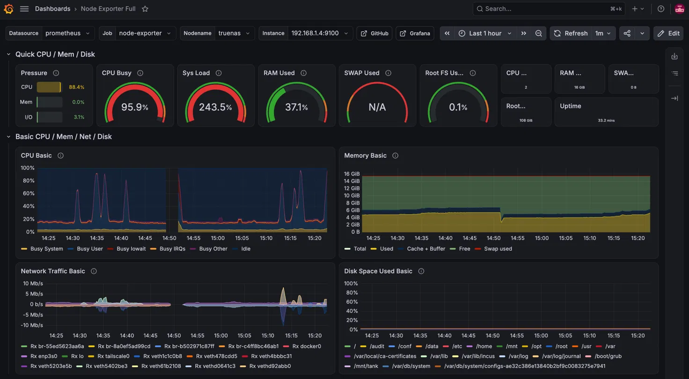
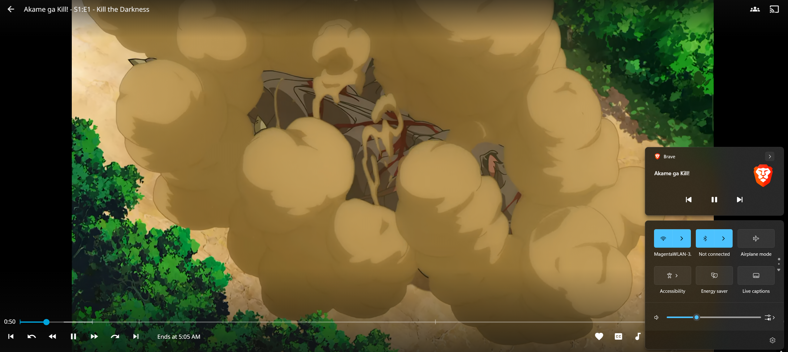

# Media Streaming — Jellyfin

*Part of the [homelab-nas](../README.md) project.*

---

**Goal:** self-hosted media streaming from the NAS, with the library on the ZFS pool and no dependency on a third-party service.

Most of the interesting work here wasn't installing Jellyfin — it was deciding where the data should live, migrating a messy library safely, and then measuring what this CPU can and cannot actually do.

## Storage layout

```
tank/media                            # library — 35.5 GB, deliberately OUTSIDE snapshot scope
tank/jellyfin-config                  # config, metadata, plugins — host path
tank/prometheus-config                # same pattern
tank/swimming-pool/sshindow-private   # private data, still snapshotted (~26 GB)
```

Two deliberate decisions here.

**The media library sits outside the snapshot scope.** Snapshots exist to protect data that is irreplaceable and changes meaningfully — personal files. A 35 GB media library is neither: it's re-obtainable, and snapshotting it would multiply pool usage for no recovery benefit. Keeping it out of `swimming-pool/sshindow-private` keeps the daily/weekly snapshots small and fast. *(This decision has a sharp edge — see the recovery story below.)*

**Config lives on a host path, not ixVolume** — the same lesson as the [observability module](monitoring-prometheus-grafana.md), but with higher stakes. Losing Prometheus config costs a re-typed YAML file. Losing Jellyfin config costs the admin account, the library structure, and all watch history.


*`media` (35.85 GiB) and `jellyfin-config` sit at the top of the pool beside `prometheus-config`, while `swimming-pool` — the snapshotted, SMB-shared private data — stays separate. The split is the point: the library is large and replaceable, the config is tiny and irreplaceable.*

### Moving 35 GB in zero seconds

The library started inside the private dataset and needed to move out. The naive approach copies 35 GB across the pool. The correct one:

```bash
sudo zfs rename tank/swimming-pool/sshindow-private/jellyfin-media tank/media
```

`zfs rename` is a **metadata-only operation** — instant, regardless of dataset size. No data is read or written.

It is not free of consequences, though, and both showed up immediately:

- The **Cloud Sync task broke**, since its destination path no longer existed *(disabled rather than repointed — the library no longer needs syncing)*
- The dataset **left the `NAS-VN` SMB share**, because share membership follows the dataset's position in the hierarchy

Neither is a fault. They're the predictable result of moving a dataset in a tree where other things reference its path — worth knowing before running the command, not after.

## Library migration

**Source:** a Google Drive folder pulled down by the existing [Cloud Sync task](google-drive-backup.md).

**The problem:** nine seasons accumulated over years, containing **four different video naming conventions and three subtitle conventions** — and subtitle *language* was encoded in the **folder name**, not the filename. No single regex handles that.

**The method** — this is the part worth copying:

1. A bash script with `DRYRUN=1` as the **default**, so running it accidentally does nothing
2. **Four preview iterations** before a single file moved, each one exposing another convention the previous pass had mishandled
3. `mv`, not `cp` — within the same dataset a move is a metadata operation, so 35 GB relocates instantly and there's no half-copied intermediate state

**Result:** 204 files covering **208 episodes** — four are double-length (S07E23–E24, S08E11–E12, S09E01–E02, S09E23–E24). Subtitles: **200/208 English**, **184/208 Vietnamese**.

### Two accidental `rm -rf`s, both recovered

During migration, two `rm -rf` commands deleted the wrong thing. Both were recovered from ZFS snapshots via the `.zfs/snapshot/` directory — no backup restore, no re-download, minutes rather than hours.

The second recovery is the one that matters:

> The daily snapshot `daily-20260823-0200` had **already been destroyed by retention**. Recovery had to come from `weekly-20260823-0300` instead.

That is the [snapshot module](zfs-snapshots.md) paying for itself, and it's also the argument for *layered* retention rather than a single schedule. A 7-day daily policy alone would have been enough — but only just, and only because the mistake was noticed quickly. The weekly tier is what actually caught it.

It's also a live demonstration of the tradeoff above — but not in the obvious direction. The deletions happened after the zfs rename, at /mnt/tank/media/. Recovery worked because snapshots travel with a dataset through a rename: all seven inherited snapshots came along and remained readable under /mnt/tank/media/.zfs/snapshot/.

The catch is that this safety net is decaying. No periodic task creates new snapshots on tank/media — that was the entire point of promoting it out of sshindow-private. The inherited ones age out on their original schedule (7-day dailies, 4-week weeklies), so within a month the library has no local recovery layer at all. That's the intended trade for a replaceable 35 GB library, but it's a deliberate choice with an expiry date, not a permanent state.

## Jellyfin configuration

| Setting | Value |
|---|---|
| Web UI port | `30014` (TrueNAS-assigned — **not** the documented 8096) |
| Library mount | `/mnt/tank/media` → `/media`, **read-only** |
| Server name | `truenas-jellyfin` |
| Library | type *Shows*, path `/media/tv` |
| Trickplay / chapter images | **disabled** — both are CPU-expensive on a Pentium G3240 |
| Ownership | `chown 568:568`, `chmod 755` |

**Read-only mount vs NFO metadata — a genuine either/or.** Jellyfin can write `.nfo` metadata sidecars next to media files, which makes the library portable between servers. That requires write access. A read-only mount means the media dataset cannot be modified by the container at all.

Isolation won. Metadata lives in `tank/jellyfin-config` instead, which is itself on a durable host path. Both *save-to-media* toggles were switched off after they produced a stream of `IOException` noise in the logs — the container correctly failing to write to a read-only mount.

A **Movies** library was added later, once the [arr-stack](arr-stack.md) started delivering films — the container already had the whole media dataset mounted, so this was a simple in-UI add (`/media/movies`) rather than a compose/volume change. Settings deliberately match the existing read-only-aware setup: NFO/artwork save-to-media both off, Trickplay/chapter extraction off, and **real-time monitoring on** so new Radarr downloads appear without waiting for a scheduled scan.

## Transcoding — the headline finding

| Client | Codec | Result |
|---|---|---|
| Native app | XviD | **Direct play** |
| Native app | H.264 | **Direct play** |
| Browser | XviD | Transcode → `libx264`, 576×432 |
| Browser | H.264 | **Direct play** |

Only one of four combinations transcodes: **an old codec played in a browser**.

Because the [Prometheus/Grafana stack](monitoring-prometheus-grafana.md) was already running, that transcode could be measured rather than guessed at:

| Metric | During browser transcode |
|---|---|
| CPU busy | **95.9%** |
| Load | 243.5% |
| CPU pressure | 88.4% |
| Memory | 0.0% |
| I/O | 3.1% |

**Purely compute-bound.** Memory and disk are untouched; the CPU is saturated. That single reading is what turned "should I add a GPU?" from a preference into a decision with evidence behind it — and it's the observability module earning its place two weeks after being built.


*The whole argument in one frame: CPU busy 95.9% and CPU pressure 88.4%, while memory pressure sits at 0.0% and I/O at 3.1%. A GPU accelerates the saturated resource — here that is the CPU's encode work, and only for a case the native client avoids entirely.*

### What the transcode actually is

`ps aux | grep ffmpeg` shows nothing during playback, so the evidence comes from the container's own logs:

```bash
sudo docker logs --tail 200 ix-jellyfin-jellyfin-1 2>&1 | grep -i "ffmpeg\|transcod"
```

```
MediaBrowser.MediaEncoding.Transcoding.TranscodeManager:
/usr/lib/jellyfin-ffmpeg/ffmpeg -analyzeduration 200M -probesize 1G
  -ss 00:12:45.765 -i file:"/media/tv/<series>/Season 01/<series> - S01E01.avi"
  -map_metadata -1 -map_chapters -1 -threads 0 -map 0:0 -map 0:1 -map -0:s
  -codec:v:0 libx264 -preset veryfast -crf 23 -maxrate 4790804 -bufsize 9581608
  -profile:v:0 high -level 51
  -x264opts:0 subme=0:me_range=16:rc_lookahead=10:me=hex:open_gop=0
  -force_key_frames:0 "expr:gte(t,n_forced*3)" -sc_threshold:v:0 0
  -vf "...,scale=trunc(min(max(iw,ih*a),min(576,432*a))/2)*2:
        trunc(min(max(iw/a,ih),min(576/a,432))/2)*2,format=yuv420p"
  -codec:a:0 copy
  -f hls -hls_time 3 -hls_segment_type mpegts -hls_playlist_type vod
  -hls_segment_filename "/cache/transcodes/<id>%d.ts" -y "/cache/transcodes/<id>.m3u8"
```

Five things in that command line are worth reading closely:

- **`-codec:a:0 copy`** — audio is passed through untouched. Only the *video* is re-encoded, which is exactly why Grafana showed the load as pure CPU with no I/O component.
- **`-preset veryfast`** — Jellyfin already selects one of the fastest x264 presets, and it *still* saturates the CPU. There is no tuning headroom left to reclaim; the encoder is not being asked to work hard for quality's sake.
- **`-threads 0`** — ffmpeg takes every core available. That matches the observed load of 243.5% on a dual-core CPU: both cores pinned, with runnable processes queued behind them.
- **`-f hls -hls_time 3`** — output is segmented into three-second HLS chunks. This is the mechanism behind the `ps aux` gotcha: ffmpeg races ahead of playback, writes a batch of segments, exits, and is respawned later. Polling the process table catches the gaps far more often than the work.
- **`scale=...min(576,432*a)...`** — the downscale to **576×432** is written into the filter chain, confirming what the client negotiated rather than what was assumed.

The log also shows `FFmpeg exited with code 0` repeatedly between invocations — the same burst-and-exit pattern, visible from the other side.


### Why the GTX 650 stays out

The spare GTX 650 was evaluated for hardware transcoding and **rejected on four independent grounds**, any one of which would have been sufficient:

1. **Driver EOL.** Kepler support ends at the 470.xx branch, which will not bind on TrueNAS SCALE 25.10.
2. **NVENC generation 1** is H.264-only — and H.264 already direct-plays. It would accelerate exactly the case that doesn't need acceleration.
3. **It wouldn't help Frigate either.** Frigate's detectors need compute capability 5.0+; Kepler is 3.0.
4. **The problem quadrant disappears for free.** Using the native client instead of a browser eliminates the only transcoding case that exists.

**Intel Quick Sync is the fallback if transcoding ever becomes necessary — it is not currently enabled.** The G3240's Haswell iGPU covers the same H.264 encode ground the GTX 650 would have, with no PCIe card, no extra idle draw, and no NVIDIA-driver-on-SCALE problem. Two caveats are recorded rather than assumed away:

- **The measured transcode above used `-codec:v:0 libx264` — a software encoder.** Hardware encoding appears as `h264_qsv`. So QSV was *not* in the path when that measurement was taken, and the 95.9% CPU figure is a software-encode number.
- **Haswell sits well outside Jellyfin's supported range for QSV.** The project's hardware guidance recommends 11th-gen or newer and notes that 7th–10th gen have been deprecated by Intel; a 4th-gen Pentium-tier part is several steps further back.

Verification is a single grep rather than an assumption: play the XviD file in a browser and look for `h264_qsv` in the ffmpeg command line. If it still reads `libx264`, hardware transcoding is not active regardless of what the Playback settings page claims — and the Grafana CPU panel gives the same answer from the other direction.

The cheapest fix for a performance problem is often to stop creating it. Adding a GPU would have drawn constant idle power to solve a case that a client-side choice removes entirely.

### Germany-distance verification (2026-08-28)

Back in Germany, the prediction in "Still open" below was tested for real: does Direct Play scale with distance the way the theory predicts, and does the one transcoding case (browser + old codec) still behave the same way at real Vietnam↔Germany distance instead of on the LAN?

**Direct play — confirmed, bitrate-bound as predicted.** An H.264 episode played over Tailscale from a genuine German connection (exit node off — this only needs the base tailnet mesh, same reasoning as the other cross-country tests) with `docker stats` showing the Jellyfin container at **1.73% CPU** — effectively idle, no transcode running. Activity Monitor Rcvd Bytes measured **244.9 MB → 267.2 MB (+22.3 MB) over ~90s (±15s)**, giving **≈248 KB/s ≈ 1.98 Mbps down**. Trivial next to the >90 Mbps home connection measured for the exit node, and consistent with the prediction: distance doesn't matter once no transcode is needed.



**The transcode case — same codec path, new failure mode.** Playing an old `.avi` episode in the browser (the one case from the table above that transcodes) triggered the same `libx264` software encode documented above, but this time **playback never started**. Two separate attempts both ended the same way: ffmpeg launched, ran for ~50 seconds, then exited normally (`code 0`) once the browser gave up waiting and closed the connection. `docker stats` during the attempt showed the container at **158.36% CPU** — most of both cores, on top of whatever else the box is running now (Frigate, the arr-stack containers, etc. — all added to this NAS after the original in-Vietnam 95.9%-CPU measurement above). The `-analyzeduration 200M -probesize 1G` deep probe this codec requires stacks on top of that CPU pressure, likely pushing time-to-first-segment past the browser's buffering patience.

Worth stating honestly rather than overclaiming: this can't be cleanly attributed to distance alone. The box carries more background load today than when the original transcode measurement was taken, so the same stall might already reproduce on the LAN. What's confirmed is that this specific transcode path is not currently reliable from Germany; what's unconfirmed is how much of that is distance versus a now-busier NAS.

### Real-world remote playback throughput (2026-08-28)

The Direct Play result above (1.98 Mbps, trivial) turned out **not to generalize** to higher-bitrate content — found via the [arr-stack](arr-stack.md)'s first real downloaded movie, not during planned testing. A newly-downloaded film (Blu-ray-tier 1080p x264 + EAC3 Atmos, 6.2 GiB) stuttered constantly when streamed live from Germany — freeze, catch up, repeat.

**Ruled out in order:** NAS CPU (`top` showed 74.7% idle — the Atmos audio only needs a lightweight remux/"Direct Streaming," not a real transcode); a DERP-relayed Tailscale connection (`tailscale status` confirmed `direct <IP>:41641` — genuinely peer-to-peer); raw bandwidth (a generic speedtest from the NAS showed a healthy 161.83 Mbps upload).

**Real cause, found with `iperf3` run directly over the Tailscale link** (NAS↔MacBook, reverse mode to match the actual streaming direction): sustained throughput was only **~3.78 Mbps**, with heavy retransmissions (128 retries in ~10s) and multiple full one-second windows of literal zero bytes transferred — a TCP congestion window collapsing from 180 KB to 8 KB, the signature of real packet loss on the international route rather than a bandwidth ceiling. The generic speedtest's 161 Mbps was measuring a nearby regional server, not the actual Vietnam→Germany hop — consistent with Vietnam's known international submarine-cable congestion, a structural ISP-level issue with no NAS-side or Jellyfin-side fix.

**Practical workaround adopted:** manually cap Jellyfin's player Quality/bitrate setting for remote playback instead of Auto/Direct Play. ~1.5 Mbps still had occasional 1–2s freezes; the lowest available tier (~420 Kbps) eliminated freezing entirely but looked noticeably degraded. No bitrate gives both smooth playback and good quality simultaneously on this path — an honest structural limitation, not a config bug.

**Alternative researched and explicitly declined:** relocating the arr-stack + Jellyfin to a European-hosted seedbox/VPS would fix this at the root (a short Netherlands↔Germany hop instead of an intercontinental one). Bundled seedbox providers with one-click Radarr/Sonarr/Jellyfin run roughly €5–14/month; a DIY cheap-VPS-plus-storage route can run cheaper (~€3–10/month) but means rebuilding the whole stack. **Not pursued** — the actual use case for this stack is occasional downloads of rare films not on existing streaming subscriptions, not primary daily viewing, so the added recurring cost/complexity isn't justified. Revisit only if remote movie-watching becomes frequent enough to justify it.

**Net takeaway:** Direct Play of already-low-bitrate content (TV episodes, ~2 Mbps) works fine live from Germany. Anything at a film's native Blu-ray-tier bitrate (typically 8–15+ Mbps) will not stream smoothly live — plan on either a heavily quality-capped live stream, or downloading the file first and playing it locally.

## Gotchas

- **zsh expands `~208` in inline comments** → `no such user`. Bit twice while annotating episode counts in scripts.
- **zsh globs `[f]fmpeg`** — the classic "don't match my own grep" trick needs quoting in zsh.
- **`ps aux | grep ffmpeg` misses transcodes.** Jellyfin bursts ahead of playback and the ffmpeg process exits between segments, so polling `ps` shows nothing while a transcode is very much happening. Use the container logs instead.
- **Container ID changes on every restart**; the name `ix-jellyfin-jellyfin-1` is stable. Same rule as Prometheus and Frigate — never cache the ID.

## Still open

- **Missing subtitles** — S06E21–24 English, ~20 episodes of S09 Vietnamese. [Bazarr](arr-stack.md) was connected and a search triggered, but the count never moved past 182/208 — accepted as-is rather than pursued further.
- **Series and season poster art.** Episode thumbnails fetched correctly; the higher-level artwork did not.
- ~~**Germany-distance playback test.**~~ Confirmed 2026-08-28 — see "Germany-distance verification" above. Direct play is bitrate-bound as predicted (~1.98 Mbps for one H.264 episode); the browser-transcode case, however, failed to start over real distance and needs revisiting once the arr-stack's added CPU load is accounted for.
- **Real remote-playback throughput ceiling** (~3.78 Mbps sustained Vietnam↔Germany, see above) means Blu-ray-tier content needs a manual bitrate cap or a local download — accepted as a structural limitation for now given the stack's actual (occasional-download) usage pattern.

**Status:** ✅ Operational — 208 episodes plus a growing Movies library (via the [arr-stack](arr-stack.md)) catalogued and streaming, config on durable storage, transcoding behaviour measured and understood, the hardware-acceleration question closed with evidence, Direct Play confirmed working at real Germany↔Vietnam distance, and the real-world remote-throughput ceiling measured and worked around.
