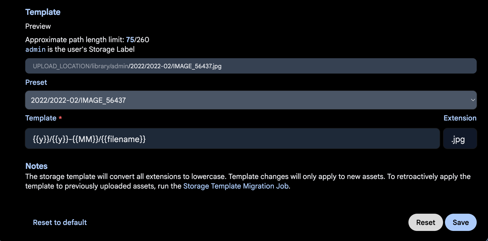
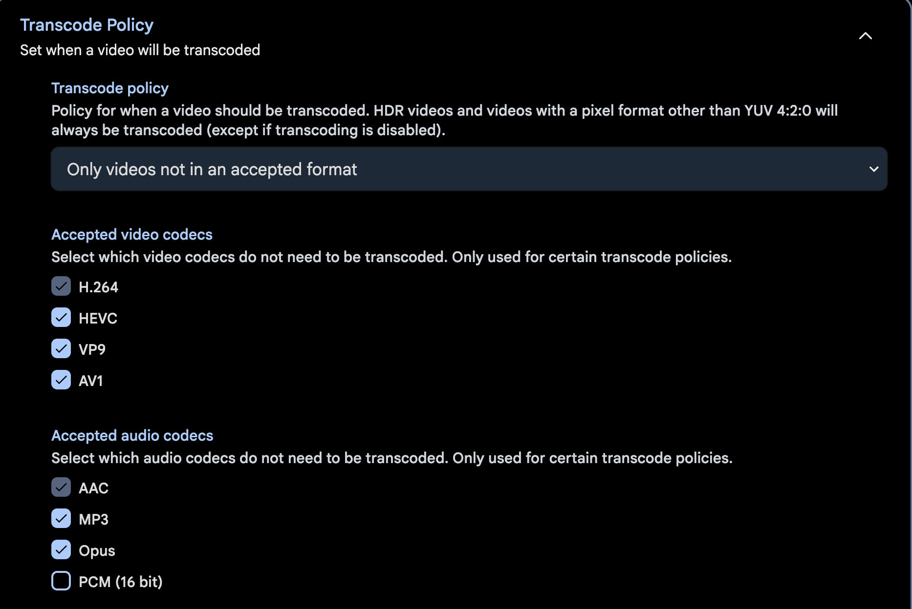
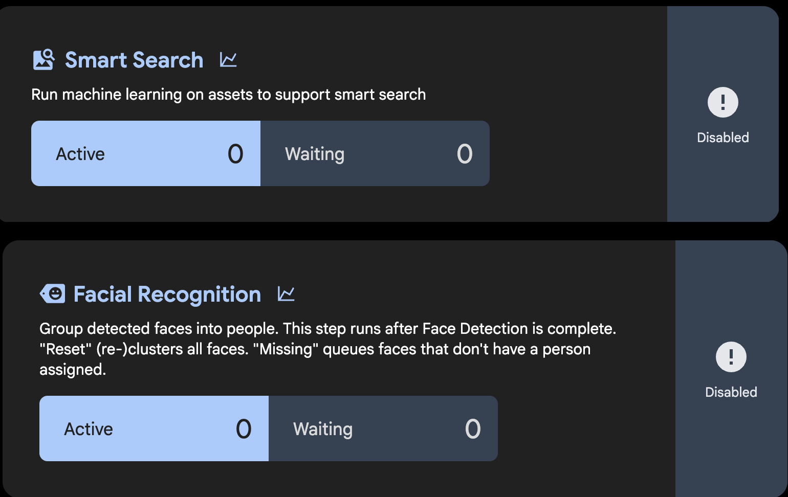
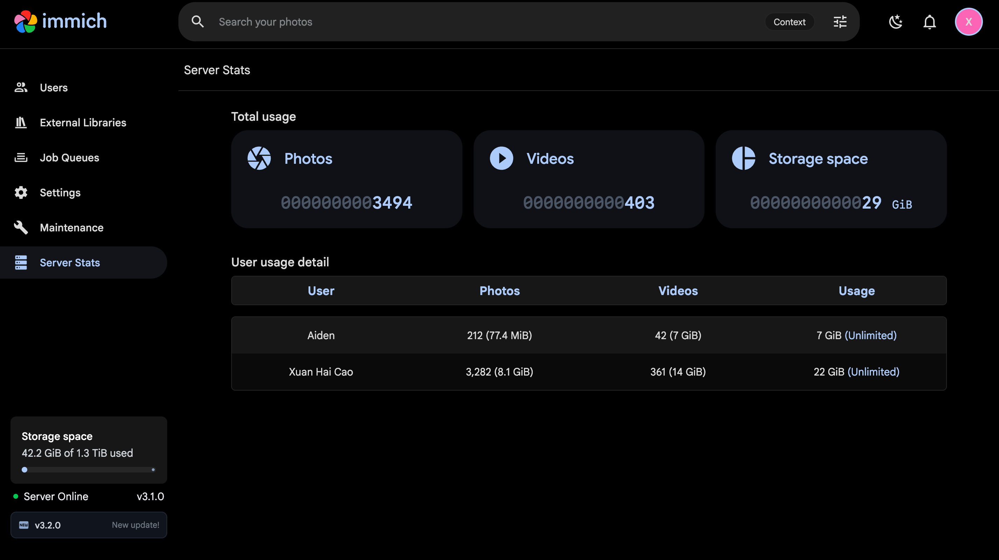

# Self-Hosted Photo Management (Immich)

*Part of the [homelab-nas](../README.md) project.*

---

**Goal:** replace a paid 50 GB iCloud+ tier with a self-hosted photo and video library on the NAS, backing up automatically from an iPhone and an iPad and browsable from every device — without the photos living on someone else's infrastructure, and without the library becoming unreadable if the application ever goes away.

The motivating problem was concrete rather than ideological: the iCloud tier was full, which meant photo sync had silently stopped and the phone's camera roll had **no backup at all**. Fixing that was the first priority; dropping the subscription was the second.

## Architecture

Four containers, deployed from the TrueNAS SCALE community catalogue (chart `1.14.35`, Immich `v3.1.0`) rather than as a hand-written Custom App — unlike the [arr-stack](arr-stack.md), this one has a maintained catalogue entry, so there was no reason to hand-roll the compose.

| Container | Role |
|---|---|
| `server` | API + web UI, port `30041` |
| `pgvecto` | PostgreSQL 18 with vector extension |
| `redis` | Job queue |
| `machine-learning` | CLIP / face detection (installed, jobs disabled — see below) |

**Storage** follows the same durable host-path pattern already proven for Prometheus, not the ixVolume default:

```
tank/immich
├── data      # library, uploads, thumbnails, encoded video, DB dumps — owned 568:568
└── pgData    # PostgreSQL data directory — owned 999:999
```

`tank/immich` sits at the top level of the pool, deliberately parallel to `tank/media` rather than nested under `tank/appdata`. The reasoning is that these are **primary user data**, in the same category as the media library, not application configuration — which makes them easier to snapshot on their own schedule and to replicate independently later.

**Resource limits** were set to 2 CPUs / 6144 MB rather than the chart's 4-core / 8 GB defaults, which assume hardware this box doesn't have. Both are editable without a reinstall.

### Precondition: reclaiming capacity first

This module was only comfortable to add because [Frigate was decommissioned](camera-nvr-frigate.md) immediately beforehand, freeing 36.4 GB of pool and the 13–15% sustained CPU it consumed. Load average dropped from 2.09 to ~1.15 as a direct result. Adding Postgres, Redis and a Python ML runtime to a 2-core box already running Jellyfin, the arr-stack, Prometheus and Grafana would otherwise have been a genuinely tight fit.

## Four settings that had to be right before the first upload

Immich is easy to install and easy to configure into a shape that's expensive to change later. Four decisions were made deliberately **before any photo was uploaded**:

**Storage template — `{{y}}/{{y}}-{{MM}}/{{filename}}`.** With the template engine off, Immich stores everything under opaque UUID paths that are meaningless without its database. With it on, the library is a plain year/month folder tree readable by any file browser. For an archive intended to outlive the application, that matters more than it sounds: if Immich breaks, is abandoned, or gets migrated away from, the photos are still just files in sensible folders. Month-level rather than the default day-level granularity, to avoid ~365 near-empty directories per year. Changing this after the fact is possible via a migration job, but it rewrites every path on the pool.


*The template and its live preview. Immich's own note spells out the cost of getting this wrong: changes apply only to new assets, and retrofitting means running the Storage Template Migration Job across the whole library.*

**HEVC (plus VP9 and AV1) added to the accepted-codec list.** This is the one with the sharpest failure mode. iPhones have recorded video in HEVC by default since iOS 11, and the chart's default accepted-codec list is H.264 only — so *every* video uploaded would have been queued for a software transcode. On a Pentium G3240 with no hardware acceleration anywhere in the box (see [Media Streaming](media-jellyfin.md) for the full GPU/Quick Sync evaluation), that would have pinned both cores for days. Every client device decodes HEVC in hardware, so there is no reason for the NAS to touch these files at all.


*HEVC, VP9 and AV1 added alongside the H.264 default, with the policy set to transcode only what isn't in an accepted format. Without the three additions, every iPhone video would land in a transcode queue this CPU cannot drain.*

**Machine-learning jobs disabled.** The ML container is installed but Smart Search and Facial Recognition are both off. Running CLIP embeddings and face detection across a multi-thousand-asset library on two Haswell cores would have competed directly with the initial upload and with every other service on the box. The container is left installed rather than removed so the jobs can be enabled deliberately later, overnight, without editing the app.


*Both ML jobs disabled, queues empty. Duplicate Detection depends on this subsystem, which is why it is also unavailable — see Still open.*

**Database dumps enabled, scheduled off the snapshot times.** Immich can run a scheduled `pg_dumpall` into its own data directory. The cron was moved to `0 04 * * *` so it doesn't overlap the 02:00 daily and 03:00 weekly ZFS snapshot tasks — a snapshot taken mid-dump would capture a half-written file. The result is the database protected two ways with different failure modes: a logical dump that restores cleanly, and the raw Postgres files inside the block-level snapshot.

**Snapshot tasks were created before installation**, not after, so there was never a window where the library existed unprotected: daily 02:00 / 2-week retention and weekly Sunday 03:00 / 8-week retention, both recursive on `tank/immich`. Longer than the retention used for the documents dataset, deliberately — a bad photo deletion can go unnoticed for far longer than a missing document, and this project has already had one recovery that needed the weekly snapshot because the daily had aged out.

## Deployment problems and fixes

**The TrueNAS "Apps" dataset preset sets the ACL type but *not* ownership.** Creating `tank/immich/data` with the Apps preset produced a directory owned `root:root` (`0 0`), not `apps:apps` (`568:568`) as both the preset's name and Immich's own TrueNAS documentation imply. Left unfixed this is the same class of failure that crash-looped Seerr in the [arr-stack](arr-stack.md#deployment-problems-and-fixes): a container running as UID 568 unable to write into a root-owned bind mount. Fix: `sudo chown -R 568:568` on the data dataset before install. Note that `pgData` needs the *opposite* treatment — PostgreSQL runs as UID 999, and the installer's **Automatic Permissions** checkbox handles that correctly if left ticked.

**The first install failed with `Failed 'up' action for 'immich' app` — and the cause had nothing to do with Immich.** `app_lifecycle.log` showed the real error: `Get "https://registry-1.docker.io/v2/": context deadline exceeded`. No images had been pulled at all. The log also showed the unrelated arr-stack failing four times against a *different* registry in the same window, before anything in this session had been touched — which is what reframed it from an app problem to an infrastructure one.

The diagnosis then went wrong twice before going right, which is worth recording honestly:

1. **First hypothesis — `pgData` permissions.** Ruled out: no container had ever been created.
2. **Second hypothesis — IPv6-only DNS answers.** The ISP's resolver returned only AAAA records for the registry, and the NAS has a real public IPv6 address with a default route, so it was plausibly dialling an unreachable IPv6 path. Ruled out: `curl -4` and `curl -6` both timed out identically.
3. **Third hypothesis — international transit congestion.** Ruled out: a *domestic* Vietnamese site timed out too.
4. **Actual cause — the router had stopped forwarding.** `192.168.1.1` didn't respond to the NAS or to a browser over the Tailscale subnet route. DNS kept resolving from cache and the established Tailscale session survived, which is exactly why every new TCP connection failed while the box still looked alive. It recovered on its own a few hours later, and the install then succeeded unchanged.

**A misleading diagnostic worth knowing about:** four rounds of `ping` results pointed the wrong way in this investigation. The ISP's ONT drops ICMP echo, so the NAS could not ping *its own gateway* even when the LAN was completely healthy — and public resolvers appear to be filtered the same way. `curl`, `getent` and `getent ahosts` were the tools that actually distinguished DNS resolution from TCP reachability. On this network, a failed ping means nothing.

**Switching the NAS to third-party DNS made things strictly worse.** As part of chasing the registry failure, the host's nameservers were changed from the ISP's own resolvers to Cloudflare and Google. Resolution then failed completely — `Temporary failure in name resolution` rather than a wrong answer. **VNPT appears to block outbound port 53 to third-party resolvers**, forcing traffic onto its own DNS. The change was reverted.

> This has a consequence that reaches back into an earlier module. The [arr-stack](arr-stack.md) carries per-container `dns: [1.1.1.1, 1.0.0.1]` overrides, documented as the fix for this ISP's DNS interference. If port 53 to those resolvers is genuinely blocked from this network, those overrides cannot be doing what they appear to — Docker's embedded resolver would be falling back to the host's configuration. The apparent fixes may have been coincidental recovery rather than cause and effect. **Not yet re-tested; flagged here rather than quietly corrected.**

**A runaway download-client process was found consuming the box, unrelated to Immich but blocking it.** With Immich installed but idle, load average sat at ~6 on two cores with `100% sy` / `0% us` — all kernel time, no userspace work. `top` showed the download client at 112% CPU and 2.3 GB resident, with `kswapd0` and `arc_evict` both active and 165 MB free: the kernel was thrashing on memory reclaim rather than doing work. Pausing its queue and restarting the container dropped load to 1.15 and its own footprint to 19 MB. The stack's documented configuration covers a seeding ratio limit but had never capped **connection counts** — on a consumer ONT with a small NAT table, uncapped peer connections are also a plausible contributor to the router outage above. Caps added: 200 global connections, 50 per item, 20 upload slots, and I/O threads reduced from 10 to 4 to suit a 2-core box.

## Migration and verification

The initial upload was ~20 GB / 3,179 assets from the iPhone, completed overnight in a single unattended run — faster than the project's assumed throughput predicted (see below).

**iOS restricts background uploads**, so a bulk first sync realistically needs the app open with Auto-Lock disabled. Background backup is designed to keep up with a handful of new photos a day, not to push 20 GB. Steady-state operation since has needed no intervention.

**One iOS setting has to be checked first:** if **Settings → Photos** is set to *Optimize iPhone Storage*, some full-resolution originals live only in iCloud and the device holds degraded copies — which Immich would faithfully back up. *Download and Keep Originals* must be confirmed, and the downloads allowed to finish, before starting.

Verification, before trusting anything:

```
$ ls /mnt/tank/immich/data/library/admin/
2009  2018  2019  2020  2021  2022  2023  2024  2025  2026

$ ls /mnt/tank/immich/data/library/admin/2026/
2026-01  2026-02  2026-03  2026-04  2026-05  2026-06  2026-07  2026-08
```

That confirms the storage template applied to real files rather than just the settings-page preview, and that the library is navigable without the application.

**Server-side counts are the thing to verify, not the client's progress indicator.** The mobile app reporting a backup complete is not sufficient evidence to delete local originals; Administration → Server Stats, or a direct `find … | wc -l` on the dataset, is. This is now standard practice for this module.


*Server-side counts across both users — the number that should gate deleting local originals. 42.2 GiB of 1.3 TiB used, including the derivatives that make the library store roughly 1.6× what it ingests.*

### Desktop and bulk imports

There is **no desktop sync client** for Immich — the browser covers viewing, and the official CLI covers bulk upload:

```
npx @immich/cli login http://<nas>:30041/api <api-key>
npx @immich/cli upload --recursive --album --dry-run "H:\Media\Image"
```

`--dry-run` reports the file count, total size, and how many are already-known duplicates before anything transfers. `--album` (not `--album-name <name>`, which forces everything into one) derives album names from folder names, which turned an existing folder structure into albums for free. The CLI checksums before uploading, so pointing it at folders that overlap with what the phone already sent is safe — a 436-file import reported 434 new and 2 already present.

**The CLI holds one session at a time.** After logging in as a second user, every subsequent upload goes to that user's library until an explicit re-login. Worth checking before any upload rather than discovering it afterwards.

### Multi-user isolation

Immich supports multiple users with fully isolated libraries — one user's assets do not appear in another's timeline, and each gets its own directory under `data/library/`. A second account is used here to keep a category of media separate from the main timeline.

Worth being precise about what this does and doesn't provide. It is **access isolation, not encryption**. Files sit unencrypted on the pool in the same readable date-folder structure as everything else; anyone with shell access, a snapshot, or the physical disks can read them. Immich's archive and favourites features are organisational, not protective — there is no password-gated album. For a threat model of "someone picks up my phone" this is adequate; for anything stronger it isn't, and an encrypted container accessed over SMB would be the right tool instead.

A second user with no **storage label** set gets a UUID directory name rather than a readable one. Worth setting at creation, while the library is still small — changing it later means running the storage migration job.

## Off-site backup

The photo library and the private documents dataset were both pulled to an external SSD physically located in the other country, giving a genuine geographic second copy rather than another disk in the same box.

`rsync` over SSH, pulled from a Windows PC via WSL. Two things about that path are non-obvious:

**`rsync -a` silently discards files when the destination is a Windows drive.** WSL mounts Windows volumes through `drvfs`, which cannot set Unix ownership, permissions or timestamps. Archive mode fails on `mkstemp` for every file — and rsync still *transfers the data* to keep the protocol in sync before throwing it away. Multi-megabyte files appeared to copy over 15–25 minutes each and landed nowhere. The failure is visible in the output, but it scrolls past between progress bars and is easy to read as noise.

The working invocation:

```
rsync -rvh --progress --partial --inplace \
  --no-perms --no-owner --no-group --no-times --omit-dir-times \
  <user>@<nas>:/mnt/tank/immich/data/ /mnt/h/nas-backup/immich/
```

`--inplace` writes directly to the destination file, bypassing the temp-file step entirely.

**Ejecting the drive mid-session leaves a stale mount** that survives replugging — `cannot stat destination: No such device`. Fix is `sudo umount /mnt/h && sudo mount -t drvfs H: /mnt/h`, or `wsl --shutdown`.

Verification used matching file counts and sizes on both ends, then a checksum pass:

```
rsync -rvhn --checksum … <source> <destination>
```

`--checksum` hashes every file on both sides rather than comparing size and timestamp; `-n` makes it a dry run. Silence means byte-identical. 11,454 files verified clean.

**Immich stores meaningfully more than it ingests.** A 7.5 GB upload produced 11.96 GB of new data on the pool once thumbnails, previews and encoded derivatives were generated — roughly 1.6×. Worth building into capacity planning rather than sizing against original file sizes.

**This backup is manual and therefore point-in-time.** It protects the library as of the last run; anything added since exists only on the NAS. Re-running is cheap (rsync only moves what's new — an incremental run reported a 327× speedup), but it has to actually be run. A scheduled Cloud Sync task to an object-storage provider would cost roughly $0.35/month for this data volume and is the obvious upgrade if the manual discipline lapses.

## Throughput correction — the assumed figure was wrong

The [Media Streaming](media-jellyfin.md#real-world-remote-playback-throughput--variable-not-fixed-2026-08-28-updated-2026-09-08) module records a measured ~3.78 Mbps sustained on the Vietnam↔Germany path, and that number has shaped several decisions across this project — including the conclusion that Blu-ray-tier content cannot stream live, and the decision to decline a European seedbox.

Measurements taken during this module's off-site backup do not agree with it:

| Measurement | Result |
|---|---|
| `iperf3 -R`, NAS → Windows PC | **18.7 Mbps** |
| `rsync`, large files (photos/video) | **~39 Mbps** sustained (4.86 MB/s) |
| `rsync`, 36,629 small files | **~4.3 Mbps** (539 kB/s) |
| Original figure, `iperf3 -R`, NAS → MacBook | 3.78 Mbps |

Two honest caveats. The original measurement was to a different client machine, so this is not a clean like-for-like comparison — it could be a genuine path improvement, a client difference, or normal variance on a congested international route. And the throughput is visibly unstable: the `iperf3` run swung between 3 and 43 Mbps across ten one-second intervals.

The small-file result also shows that **file size dominates on a high-latency link** — the same path delivered 39 Mbps on large media files and 4.3 Mbps on tens of thousands of tiny ones, purely from per-file round-trip overhead. A single throughput number does not describe this path.

**Consequence: the Jellyfin conclusion is now unverified rather than wrong.** If sustained throughput is really in the 18–39 Mbps range, a 10–15 Mbps encode is plausibly watchable and the seedbox reasoning deserves revisiting. Flagged for re-testing rather than silently amended.

## Still open

- Machine-learning jobs (Smart Search, Facial Recognition) remain disabled — a deliberate resource decision, revisitable as an overnight batch.
- Immich's own **Duplicate Detection** job is an ML job, so it can't currently run. Near-duplicates that differ at the byte level (re-encoded on share, for instance) won't be caught by checksum deduplication alone.
- The off-site SSD copy is manual; no scheduled off-site task exists for `tank/immich` yet.
- The per-container DNS overrides in the [arr-stack](arr-stack.md) need re-testing against the port-53 finding above.
- The [Jellyfin throughput conclusion](media-jellyfin.md#real-world-remote-playback-throughput--variable-not-fixed-2026-08-28-updated-2026-09-08) needs re-measuring against the figures in the table above.
- Hardware transcoding (`/dev/dri` passthrough) is available in the chart but left off, consistent with the project-wide decision to keep Quick Sync disabled — worth revisiting only alongside Jellyfin, not independently.

**Status:** ✅ Operational — 3,600+ assets serving five devices across two countries, storage template verified on disk, database dumps scheduled, layered ZFS snapshots in place, and a checksum-verified off-site copy on another continent. The paid iCloud tier it replaced is no longer needed.
