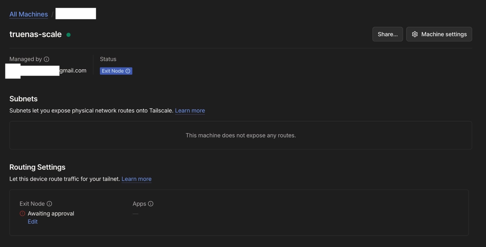
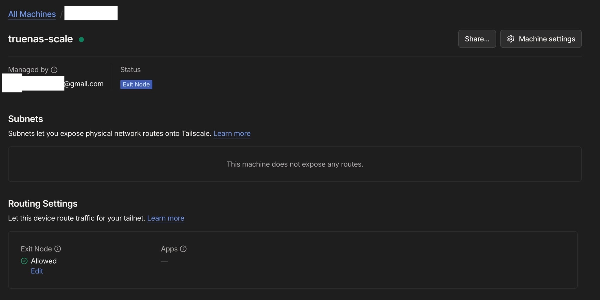
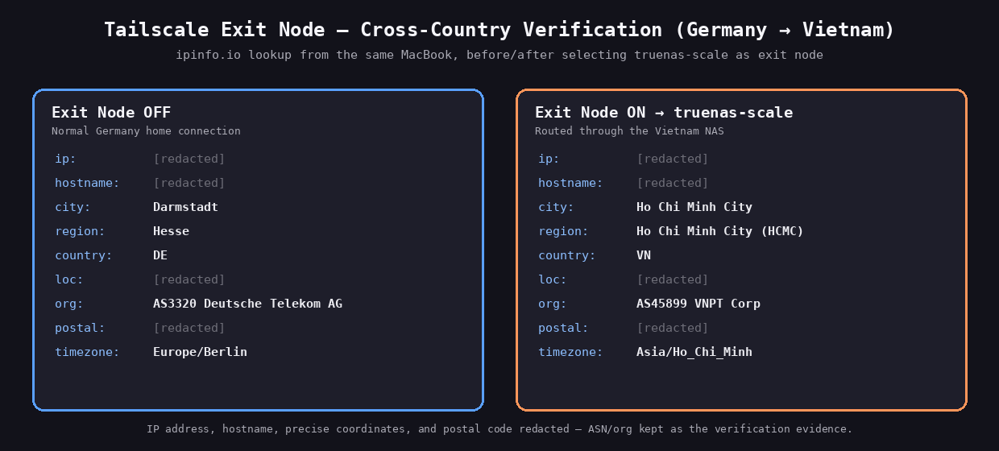
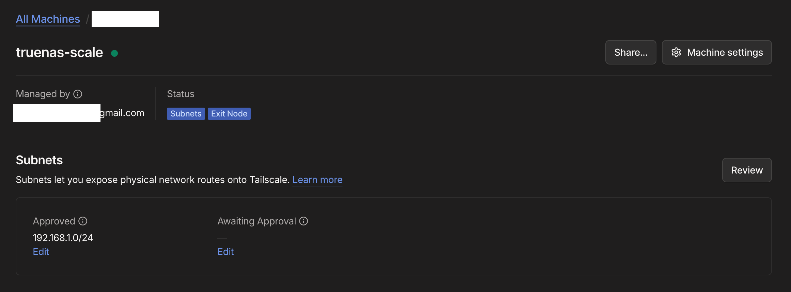

# Tailscale Exit Node

*Part of the [homelab-nas](../README.md) project.*

---

**Goal:** Route a client device's *entire* internet connection out through the home line in Vietnam, so that traffic from abroad reaches the internet via infrastructure I control and is seen by remote servers as originating from the home connection.

```
Client device (abroad)
   │  WireGuard (Tailscale)
   ▼
TrueNAS  ──►  home router  ──►  VNPT  ──►  Internet
```

**What this is, and what it isn't:** this is a *single-egress* personal VPN. It provides a Vietnamese public IP from anywhere, an encrypted tunnel over untrusted networks (hotel / café / mobile), and egress through hardware I own rather than a third party's. It is **not** a commercial VPN replacement — there is exactly one exit location and throughput is bounded by a residential upstream. The trade is control and provenance in exchange for choice of location.

## Prerequisite: kernel IP forwarding

An exit node routes packets that are neither addressed to nor originated by the host, so forwarding must be enabled at the kernel level (**System → Advanced Settings → Sysctl**):

| Variable | Value |
|---|---|
| `net.ipv4.ip_forward` | `1` |
| `net.ipv6.conf.all.forwarding` | `1` |

Saved is not the same as applied — verified directly:

```bash
sysctl net.ipv4.ip_forward net.ipv6.conf.all.forwarding
```


*Both forwarding tunables enabled under System → Advanced Settings → Sysctl.*

## Configuration change: Userspace networking had to be disabled

This reverses a decision from the original Tailscale install above. In **Userspace** mode, Tailscale runs its own TCP/IP stack inside the container and never touches the host's routing tables — fine for acting as a client, but it means the node can advertise an exit route it is structurally incapable of servicing.

| Setting | Value | Why |
|---|---|---|
| Advertise Exit Node | **on** | advertises `0.0.0.0/0` and `::/0` |
| Userspace | **off** | userspace stack cannot forward other devices' traffic |
| Host Network | **on** | container needs the host's real network namespace |
| Accept Routes | off | this node isn't a subnet-router client |
| Advertise Routes | empty | subnet routing is a separate feature, kept out of scope |
| Timezone | `Asia/Ho_Chi_Minh` | readable log timestamps when debugging from another country |


*Advertise Exit Node enabled, Userspace disabled.*

**Problem discovered:** with every prerequisite satisfied — sysctls verified, `Advertise Exit Node` checked, app redeployed — the Tailscale admin console showed the node as connected but with **no exit-node status at all**. Not "awaiting approval"; nothing.

**Diagnosis:** the TrueNAS UI and the Tailscale admin console are both layers above the process that actually matters. Rather than trusting either, I queried the daemon's own preferences:

```bash
sudo docker exec ix-tailscale-tailscale-1 tailscale debug prefs
```

```json
{
  "AdvertiseRoutes": null,
  "NetfilterMode": 2,
  "NoSNAT": false
}
```

`AdvertiseRoutes: null` while the UI checkbox was enabled — the GUI and the daemon disagreed, so the configuration was never reaching the process. `NetfilterMode: 2` and `NoSNAT: false` were useful *negative* evidence: firewall and NAT were already correct, isolating the fault to route advertisement alone.

**Root cause:** the container runs with `Auth Once` enabled and was already authenticated, with state persisted on an ixVolume. On restart, `containerboot` takes the "already logged in" path and applies options via `tailscale set` instead of `tailscale up`. There is an upstream bug in which `--advertise-exit-node` passed through `TS_EXTRA_ARGS` is silently ignored by the `set` sub-command — so the checkbox had no effect at all.

- [tailscale/tailscale#14496](https://github.com/tailscale/tailscale/issues/14496)
- [truenas/apps#3486](https://github.com/truenas/apps/issues/3486)

**Fix:** apply the flag directly to the daemon.

```bash
sudo docker exec ix-tailscale-tailscale-1 tailscale set --advertise-exit-node
# "AdvertiseRoutes": ["0.0.0.0/0", "::/0"]
```

The node then appeared in the admin console as *awaiting approval*, and was approved at **Machines → truenas-scale → Routing Settings → Exit Node → Allowed**. Advertising alone is deliberately not enough — Tailscale requires an admin to sign off before a node can act as the tailnet's internet gateway.



*Before and after admin approval: advertising alone leaves the node unusable as an exit.*

> **⚠ Operational caveat:** this setting lives in the daemon's persisted state, **not** in the TrueNAS app configuration. It survives restarts and reboots, but rebuilding the app from its TrueNAS settings alone would not restore it, and an app update may re-run the broken code path. Post-upgrade check: re-run `tailscale debug prefs` and confirm both default routes are still present.
>
> **Persistence verified:** a full reboot was tested afterwards — `AdvertiseRoutes` survived, and the node came back advertising and still approved. So `containerboot` ignores the flag but does not *clear* it: once set on the daemon, the setting sticks. The remaining risk is anything that discards the daemon's state (volume recreated, re-authentication, the `Reset` toggle), not an ordinary restart.

## Verification — and why the obvious test would have been worthless

The intended test — "connect from abroad, confirm a Vietnamese IP" — could not be run, because testing was done while physically in Vietnam, on the same network as the NAS. A public-IP check would have returned the same address with the exit node on *or* off: a result that looks like success while proving nothing.

Instead, I compared **autonomous system numbers** across two genuinely different access networks — a phone on mobile data (Viettel) versus the home line (VNPT). An ASN identifies the network that announces an IP block to the global routing table, so a change of ASN means traffic re-entered the internet from a different provider's infrastructure. That is not something a DNS trick or a cached response can fake.

| Exit node | Public IP | Reverse DNS | ASN |
|---|---|---|---|
| **off** | `125.235.x.x` | `…adsl.viettel.vn` | **AS7552 Viettel** |
| **on** | `113.173.x.x` | `static.vnpt.vn` | **AS45899 VNPT** |

*(Public IPs partially masked — the ASN is the evidence here, not the address. Both are dynamic residential/mobile addresses.)*


*Same device, three minutes apart: the originating network changes from AS7552 Viettel to AS45899 VNPT.*

Corroborated on the NAS itself, which accounted for the traffic it carried — 78 MB transmitted to the client, measured at the router rather than at either endpoint:

```
iphone-13-pro   active; direct [2401:d800:…]:41641, tx 78447936 rx 5026320
```

**DNS:** `dnsleaktest.com` through the exit node returned `113.164.250.130` / `.138` — `system.vnptnet.vn`, VNPT. The correct result here is not "the resolvers are Vietnamese" but **"the resolvers belong to the same network the traffic exits from."** Egress is VNPT and resolvers are VNPT, so queries travel through the tunnel and resolve on the far side; the mobile carrier the device is physically attached to observes only encrypted WireGuard traffic.


*Resolvers belong to VNPT — the same network the traffic exits from.*

**Connection path:** `direct`, not `relay` — peer-to-peer, with no DERP relay in the path. The mobile client connected over **IPv6**: VNPT provides public IPv6, so NAT traversal succeeded without any port forwarding on the router.

## Cross-country verification (Germany)

Everything above proves the exit node *works* — it does not prove it is useful from where the traffic will actually originate. Every test so far was run from inside Vietnam, where the "obvious" public-IP check is meaningless (see above): mobile and home broadband are both Vietnamese, so the address barely moves. Once back in Germany, on a real foreign connection, that same obvious test becomes the *right* one — two different countries either side of the tunnel, so a direct IP/ASN comparison is now meaningful rather than a false positive.

| Exit node | Public IP | ASN | Location |
|---|---|---|---|
| **off** | German address | **AS3320 Deutsche Telekom AG** | Darmstadt, Hesse, DE |
| **on** | Vietnamese address | **AS45899 VNPT Corp** | Ho Chi Minh City, VN |

*(IP, hostname, precise coordinates, and postal code redacted — ASN and city are the evidence, same convention as the table above.)*


*Same MacBook, same ipinfo.io lookup, exit node toggled: the originating network flips from Deutsche Telekom in Darmstadt to VNPT in Ho Chi Minh City.*

Unlike the in-Vietnam test, this doesn't need the ASN-change workaround — with genuine distance between the two networks, a plain public-IP lookup is sufficient evidence on its own.

## Performance

| Scenario | Down | Up | Idle RTT | Loaded RTT |
|---|---|---|---|---|
| Mobile (5G), no tunnel | 18.35 Mbps | — | 34 ms | 174 ms |
| Mobile (5G), via exit node | 26.96 Mbps | — | 36 ms | 229 ms |
| Home LAN → domestic server | 439.56 Mbps | — | 6 ms | 17 ms |
| Home LAN → international (HK/SG) | 170 Mbps | 170 Mbps | 30 ms | 39 ms |
| **NAS → Cloudflare (upload)** | — | **155.5 Mbps** | — | — |
| **Germany home, no tunnel** | **91.09 Mbps** | **33.19 Mbps** | **10 ms** | **47 / 89 ms** ↓/↑ |
| **Germany home, via exit node** | **65.86 Mbps** | **31.00 Mbps** | **243 ms** | **266 / 277 ms** ↓/↑ |

*(The two Germany rows use speedtest.net's Ookla client, which reports idle ping plus separate download- and upload-loaded latency rather than one combined "Loaded RTT" — shown as `download/upload`. Test server also differs by design: nearest-server auto-selection puts the "off" row on a Frankfurt server and the "on" row on a Ho Chi Minh City server, since that's where each connection actually egresses.)*

Measured from the NAS itself, independent of any client or browser:

```bash
dd if=/dev/zero bs=1M count=100 2>/dev/null | \
  curl -s -o /dev/null -w 'upload: %{speed_upload} bytes/sec\n' \
  -T - https://speed.cloudflare.com/__up
# upload: 19432077 bytes/sec  →  155.5 Mbps
```

- **The exit node imposes no measurable throughput penalty.** Traffic through the tunnel (26.96 Mbps) actually exceeded the direct mobile baseline (18.35 Mbps). Routing through Vietnam obviously cannot make a phone faster — the difference is mobile variance between runs — but that is the point: both sit in the same band, so the tunnel is not the constraint.
- **The bottleneck was the mobile access link**, not the NAS. The home line sustains ~155–170 Mbps upstream, roughly six times what was observed through the tunnel.
- **Domestic and international throughput differ by ~2.5×** on the same line (439 Mbps to a Vietnamese server vs 170 Mbps to Hong Kong / Singapore). For exit-node use from Europe the *international* figure is the relevant one; quoting the domestic number would materially overstate expected performance.
- **Bufferbloat is the carrier's, not the NAS's.** The mobile link degraded 34 ms → 174 ms under load with no tunnel involved at all; through the exit node it reached 229 ms. So ~140 ms of queueing is inherent to the mobile network and ~55 ms is attributable to the extra hop. The home line stays clean by comparison (30 → 39 ms international).
- **The real cross-country cost, measured from Germany:** download dropped from 91.09 Mbps direct to 65.86 Mbps through the exit node (≈28% down), while idle latency rose from 10 ms to 243 ms — an increase of roughly 230 ms. That's consistent with genuine geographic distance (Frankfurt ↔ Ho Chi Minh City is ~9,300 km) rather than any inefficiency in the tunnel itself, and it's the number that actually matters for the stated use case — a Vietnamese egress point reached from Europe. The in-Vietnam mobile-vs-exit-node comparison above only ever measured a same-country hop and could not have surfaced this; the two picture very different things (extra-hop overhead vs. real transcontinental RTT).

## Known limitations

- Single egress location — one exit point, the home line.
- Bounded by residential upstream, and every byte crosses the home line twice (in on the downstream, out on the upstream).
- Latency: traffic from Europe traverses the full round trip to Vietnam and back, which interactive workloads will feel regardless of available bandwidth.
- Availability equals the home connection's availability — a power cut, ISP outage or router failure takes the exit node with it.
- DNS trust is shifted, not removed: queries now terminate at VNPT's resolvers instead of the local access network's. Self-hosted DNS on the NAS would keep resolution on owned infrastructure.
- Exit-node LAN access is deliberately left **disabled** — enabling it would expose the home LAN to exit-node clients, a wider blast radius than this feature needs.

## Extension: subnet router

The exit node routes *internet* traffic. A subnet router advertises a **LAN** so tailnet devices can reach machines that don't run Tailscale themselves — the router's admin page, printers, IoT devices.

Both flags are set in a single command, because `tailscale set` **replaces** the advertised set rather than appending to it — issuing them separately silently drops whichever came first:

```bash
tailscale set --advertise-routes=192.168.1.0/24 --advertise-exit-node
```

Approved in the admin console the same way the exit node was, then verified from a phone on mobile data by loading the router's admin UI at `192.168.1.1` — an address that exists only inside the home LAN. It persists across a reboot.

The practical result: the home router's admin interface is now reachable from another continent, without exposing it to the internet.


*The node now carries both badges — `Subnets` and `Exit Node` — with `192.168.1.0/24` approved and nothing left awaiting approval.*

As with the exit node itself, this proves the mechanism rather than real cross-country reachability — all verification so far was done from within Vietnam. Confirming `192.168.1.1` loads from Europe is still outstanding.

## Runbook

```bash
# Health check
sudo docker exec ix-tailscale-tailscale-1 tailscale status
sudo docker exec ix-tailscale-tailscale-1 tailscale debug prefs | grep -A3 AdvertiseRoutes

# If AdvertiseRoutes is null after an app update or rebuild, reapply:
sudo docker exec ix-tailscale-tailscale-1 tailscale set --advertise-exit-node
```

Expected: the node reports `offers exit node`, and `AdvertiseRoutes` contains both `0.0.0.0/0` and `::/0`.

**Status:** ✅ Operational and verified — exit node advertised, approved, and confirmed carrying client traffic by ASN change, with no DNS leak and no measurable throughput penalty in-country. Cross-country verification from Europe **complete**: real IP/ASN change confirmed and a genuine ~28% download / +230 ms latency cost measured from a real Germany connection.
