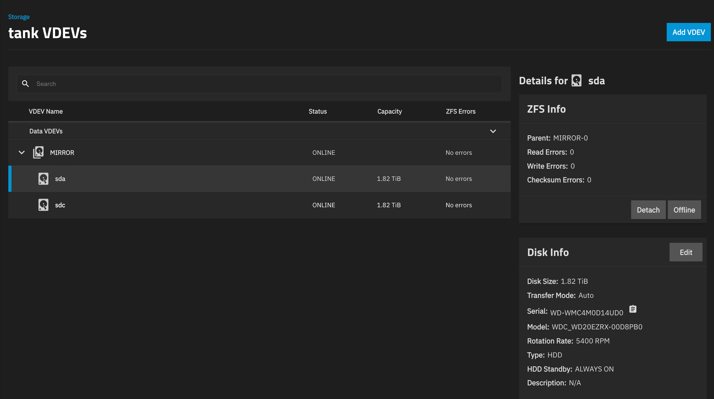

# Troubleshooting Playbook

*Part of the [homelab-nas](../README.md) project.*

---

This is a cross-cutting summary of the problems that actually cost time on this project — grouped by the pattern behind them rather than by which module they happened to surface in first. Several of these patterns recurred across three, four, sometimes five completely unrelated apps, which is the reason they're collected here instead of buried once each inside a per-module doc: the value is in recognizing "oh, this is *that* problem again" in ten seconds instead of re-diagnosing from scratch.

Each entry follows the same shape: what it looked like, what it actually was, and what to check first next time.

## 1. Container-to-container networking

### "localhost" is never another container

**What it looked like:** Prowlarr→Sonarr, Prowlarr→Radarr, Prowlarr→Lidarr, and every arr app's connection to its download client all failed to connect on first setup, with the "Server" field defaulted to `http://localhost:<port>`.

**What it actually was:** every one of these apps runs as its own container. `localhost` from inside a container means *that container*, not the one you're trying to reach — a fundamentally different failure from an actual network or auth problem, but the error text ("cannot connect," "connection refused") looks identical to both.

**The fix, every time:** swap `localhost` for the target container's name on the shared Docker bridge (`arrs-network`) — `http://prowlarr:9696`, `http://lidarr:8686`, etc. Docker's user-defined bridges give working container-name DNS automatically; no separate proxy network is needed for this.

**Check first, reflexively:** any time two containers on the *same* Docker network won't talk to each other, and the config field still shows `localhost` or `127.0.0.1`, that's the first thing to fix — before assuming a real network, firewall, or auth problem.

### Different Docker network → need the host's LAN IP instead

**What it looked like:** Seerr couldn't reach Jellyfin at `http://jellyfin:8096`; Grafana couldn't reach Prometheus at `http://prometheus:9090` or by container IP.

**What it actually was:** container-name DNS only works between containers on the *same* Docker bridge. Jellyfin, Prometheus, and Grafana each run as their own separate TrueNAS App, on their own separate Docker network — container-name resolution simply doesn't cross that boundary.

**The fix:** address the **host's LAN IP** instead (`192.168.1.4:30014` for Jellyfin, `192.168.1.4:30104` for Prometheus) — every app's published port is reachable there regardless of which Docker network it's actually on.

**The exception that cost real time:** Wizarr needed the opposite answer for the same-shaped problem — reaching Jellyfin required the NAS's own **Tailscale IP**, not its LAN IP, even though Seerr (solving the identical problem) used the LAN IP successfully. The library-scan step silently returned nothing with the LAN IP and worked immediately with the Tailscale IP. Root cause not fully pinned down; the takeaway is **don't assume the LAN-IP fix generalizes to every new tool** — if a working pattern from one app doesn't work for a new one solving the same kind of problem, try the Tailscale IP as the next thing, not more troubleshooting of the LAN-IP path.

**Check first:** if two apps are architecturally on different Docker networks (different TrueNAS Apps, not two services inside one Custom App's YAML), container-name DNS will not work between them, full stop — go straight to an IP-based address, and treat the LAN IP as the default guess but not a guarantee.

## 2. DNS / ISP interference (VNPT)

**What it looked like, three separate times, in three different containers:** one of Prowlarr's configured indexers failed repeatedly with `SSL connection could not be established`; Seerr's entire discover/search UI 500'd on every TMDB call; both looked at first like a broken indexer / broken app.

**What it actually was:** the containers' outbound DNS resolution goes through VNPT's (the Vietnamese ISP's) own resolvers by default, which intermittently interfere with specific external domains — confirmed by running `curl` for the same URL *inside* the affected container and getting a clean response every time, which ruled out a hard network/firewall block and pointed specifically at name resolution or resolver-side flakiness.

**The fix, both times:** add a `dns: [1.1.1.1, 1.0.0.1]` override to just the affected service's block in the Custom App YAML, redeploy. Confirmed via `docker exec <container> cat /etc/resolv.conf` — internal container-name resolution stays on Docker's internal DNS (`127.0.0.11`), only *external* lookups get forwarded to Cloudflare instead of the ISP.

**Check first:** this is now a **systemic risk for any container in this stack that calls an external API**, not a quirk of any one site — if a container's calls to one specific external service start failing with a vague or generic error and other integrations on the same container keep working fine, check `/etc/resolv.conf` inside that container before assuming a config or code problem.

## 3. Silent misconfiguration that looks like success

**What it looked like:** the download client's per-category save paths (`movies`/`tv`/`music`) were configured correctly, but items kept landing in the default save path anyway.

**What it actually was:** a management-mode setting deliberately kept on manual (rather than automatic, which risks silently breaking Sonarr/Radarr's hardlinks whenever a category or path changes) — but manual mode **ignores per-category save paths entirely** unless a separate, easy-to-miss setting is also enabled. (Further specifics of the download client's configuration are intentionally omitted from this write-up — see the disclaimer in [Media Automation](arr-stack.md).)

**What it actually was, a second time:** Radarr grabbed a 20–40GB Remux release under a profile intended to keep things space-reasonable. The `HD-1080p` quality profile *looks* like it means "1080p, reasonably sized" but actually includes Remux-1080p (an essentially uncompressed Blu-ray rip) as an allowed, top-ranked tier within that bucket.

**Check first:** when a setting "should" be working based on the visible config but isn't, look for a second, separate toggle that gates the first one, or check whether the named tier ("1080p") secretly includes a much larger sibling tier you didn't intend to allow.

## 4. Config-directory ownership isn't automatic for every image

**What it looked like:** Seerr crash-looped with `EACCES: permission denied, mkdir '/app/config/logs/'` on first boot, while five other containers in the same YAML came up clean with the same PUID/PGID pattern.

**What it actually was:** the five linuxserver-based images auto-chown their bind-mounted `/config` to `PUID:PGID` via an s6-init step before the app itself starts. Seerr's image sets `user: 568:568` directly with no such init step, so its config directory kept whatever ownership Docker gave it when auto-creating the bind-mount path on first run (`root:root`).

**The fix:** `sudo chown -R 568:568 <config path>`, then restart.

**Check first:** the auto-chown behaviour that's been reliable across most of this stack is a *linuxserver.io* convention, not a Docker guarantee — any newly added image that isn't linuxserver-based needs its config directory ownership checked and fixed manually, every time, rather than assumed.

## 5. A UI's status badge is not ground truth

**What it looked like:** the arr-stack Custom App sat showing "Deploying" indefinitely after adding two new services, with no further detail.

**What it actually was, in order of investigation:** `docker ps` (all pre-existing containers untouched and healthy) → `docker ps -a --filter name=<service>` (one new container stuck in `Created`, never started) → `docker start <service>` (surfaced the real error: `port is already allocated`) → the fix (reassign the colliding port) → `docker logs`/`docker top` again to confirm the *next* symptom (a container marked `unhealthy` while its startup migration was still genuinely in progress, confirmed by `docker top` showing real CPU activity, not a hang).

**Check first:** whenever a TrueNAS Custom App's status page is ambiguous or stuck, drop to the shell immediately — `docker ps -a`, `docker logs --tail 50`, and `docker top` (to distinguish "hung" from "slow but actively working") are more reliable and faster than waiting on the UI to catch up or resolve itself.

## 6. Trailing slashes and other URL-formatting bugs

**What it looked like:** Wizarr's Jellyfin server connection succeeded at "Scan Libraries" (found all three libraries correctly) but then failed the final "Test & Add" step with a plain HTTP 404.

**What it actually was:** the URL field had a trailing slash (`http://100.x.x.x:30013/`). The library-scan call apparently tolerates this; the connection-verification call likely concatenates a path onto the URL directly, producing a double-slash request path that the server rejects.

**Check first:** when one operation against a URL succeeds and a *different* operation against the exact same URL 404s, suspect the URL's exact formatting (trailing slash, missing scheme, stray whitespace) before suspecting the credentials or the target service itself.

## 7. Storage: diagnosing a "faulted" disk without touching hardware

This project's NAS is administered entirely remotely (see the [README](../README.md#hardware)'s deployment note) — a real disk fault had to be diagnosed and worked through with zero physical access, using only the TrueNAS shell.

**Step 1 — find which disk, and what kind of error.** The Storage Dashboard's top-level VDEV card only shows a pool-wide summary; drilling into **View VDEVs** shows each physical disk's individual status and error counts. `zpool status -v <pool>` gives the same information from the shell, plus the pool's own recommended action.



**Step 2 — distinguish "device unreachable" from "media failure" from the error type, before assuming the worst.** `sudo smartctl -a /dev/<disk>` failing outright with `INQUIRY failed` (not a SMART-data readout, a total failure to even query the device) escalates concern one level. But the real diagnostic signal was in the kernel log:

```
sudo dmesg -T | grep -i <disk>
```

A `hostbyte=DID_BAD_TARGET` result specifically means the SATA controller couldn't address the drive at all for that command — a different failure class from a media read error, and one worth knowing before reaching for a replacement drive. Errors scattered across essentially random sectors (from the very start of the disk to the very end) rather than clustered in one region is also a pattern that leans toward a connection/bus issue over classic media wear.

**Step 3 — a full reboot is a legitimate, low-risk remote diagnostic, not just a fix.** A reboot re-initializes the SATA controller and re-enumerates every device on the bus from scratch. If a drive comes back clean after that with no physical intervention at all, that's real evidence the previous fault was a bus/connection hiccup rather than the drive dying — and the pool stays protected the whole time on a mirror's other disk regardless of the outcome.

**Step 4 — `zpool clear` + a scrub, not just a resilver, before declaring victory.** A resilver completing with "0 errors" only proves the *specific blocks it touched* are fine. A full `zpool scrub` reads and verifies every block in the pool — and in this case, it found the same disk's checksum-error count climb from 4 to 19 *after* the resilver had already reported clean, which meaningfully changed the read on the situation from "one-off blip, probably fine" to "recurring pattern, plan an actual replacement." Neither result meant data was lost — a healthy mirror repairs checksum mismatches automatically from the other disk, and `errors: No known data errors` held true throughout — but the trend across two different error types on the same physical disk was the real signal, not either single event in isolation.

**Check first, next time an alert like this appears:** get the specific disk and error type before doing anything (View VDEVs / `zpool status -v`); check `dmesg` for the error class before assuming a dead drive; try a reboot as a legitimate diagnostic step, not just a last resort; and treat a resilver's "0 errors" as necessary but not sufficient — a scrub is the real all-clear.

**Resolution, confirmed 2026-09-06.** After `zpool clear` and a subsequent full scrub, the pool came back completely clean on both disks — the real all-clear this incident was checking for:

```
truenas_admin@truenas[~]$ zpool status -v tank
  pool: tank
 state: ONLINE
  scan: scrub repaired 60K in 04:06:25 with 0 errors on Sun Sep  6 07:57:04 2026
config:
        NAME                                      STATE     READ WRITE CKSUM
        tank                                      ONLINE       0     0     0
          mirror-0                                ONLINE       0     0     0
            235114ed-133d-412e-8a31-55ecbfbe1bc7  ONLINE       0     0     0
            88d12cfa-ba2b-4fec-8e5d-6af61c26d682  ONLINE       0     0     0
errors: No known data errors
```

The 60K repaired is well within normal — a healthy mirror silently fixing the odd checksum mismatch from the other disk is exactly the redundancy working as intended, not a sign of an ongoing problem. Both disks show zero read/write/checksum errors in the Storage Dashboard as well (see screenshot above). The planned physical drive replacement (see the [README](../README.md#hardware)) is now a precaution for next time, not an active fix.

## Meta-lessons

- **The same category of bug will recur across every new app you add to a stack, not just once.** `localhost`-vs-container-name alone was hit on at least five separate integrations across this project. Once a pattern like this is recognized, check for it *first* on the next new integration, rather than re-diagnosing from the error text each time.
- **A working fix from one app doesn't automatically generalize to the next app solving the same-shaped problem** — Wizarr needing the Tailscale IP where Seerr needed the LAN IP is the clearest example. Verify empirically rather than assuming.
- **Raw ground truth (`docker ps`, `docker logs`, `docker top`, `dmesg`, `smartctl`) beats every layer of UI built on top of it**, every time a UI's status is ambiguous, stuck, or contradicts itself.
- **"Vague error from an external-facing container" is a DNS suspect before it's a code or config suspect**, specifically on infrastructure sitting behind an ISP known to interfere with resolution.
- **A metric that completes without error isn't automatically the whole answer** — a resilver reporting "0 errors" and a scrub afterward finding new checksum errors on the same disk are both true at once; the full picture needed both.
